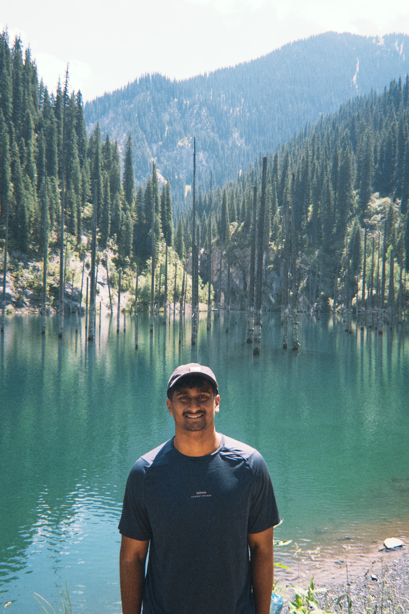
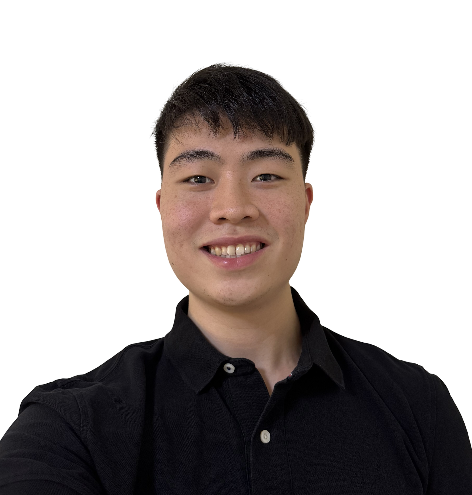

We are a team based in the [School of Computing, National University of Singapore](https://www.comp.nus.edu.sg).

You can reach us at the email `seer[at]comp.nus.edu.sg`

## Project team

### Michelle Liew

[[github](http://github.com/miche1111e)]
[[portfolio](team/michelle.md)]

* Role: Developer
* Responsibilities: UI

### Tony Victar

[[github](http://github.com/tonyvict)]
[[portfolio](team/tonyvict.md)]

* Role: Developer
* Responsibilities: Data

### Chai Jiacheng

[[github](http://github.com/cjaycee)]
[[portfolio](team/johndoe.md)]

* Role: Developer
* Responsibilities: Scheduling and tracking

### Jamunarani Prabhu Pranav

[[github](http://github.com/pranav3142)]
[[portfolio](team/johndoe.md)]

* Role: Developer
* Responsibilities: Integration

### Samuel Tan

[[github](https://github.com/samueltann)]
[[portfolio](team/johndoe.md)]

* Role: Developer
* Responsibilities: Code Quality
