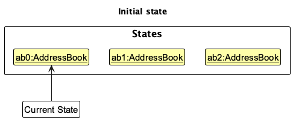
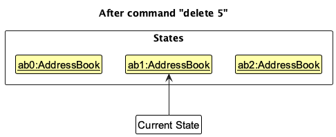
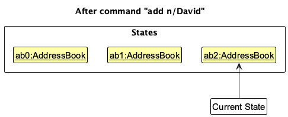
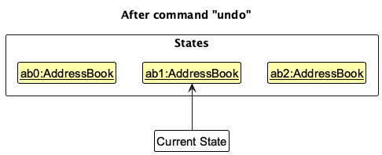
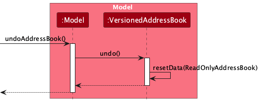
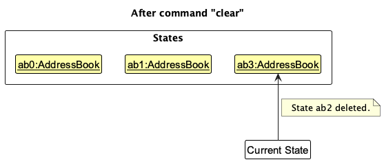

---
layout: page
title: Developer Guide
---
* Table of Contents
  {:toc}

--------------------------------------------------------------------------------------------------------------------

## **Acknowledgements**

* This project is adapted from SE-EDU's AddressBook-Level3 (AB3). We reused its architecture, code structure, and portions of documentation with modifications to suit our domain. See: AB3 repository (`https://github.com/se-edu/addressbook-level3`), UG, and DG.
* The command-parsing pattern and some utility classes are reused from AB3 with changes. Parser overview diagram concept adapted from AB3 `ParserClasses`.
* PlantUML is used for UML diagrams. Graphviz is used for rendering.

--------------------------------------------------------------------------------------------------------------------

## **Setting up, getting started**

Refer to the guide [_Setting up and getting started_](SettingUp.md).

--------------------------------------------------------------------------------------------------------------------

## **Design**

:bulb: **Tip:** The `.puml` files used to create diagrams are in this document `docs/diagrams` folder. Refer to the [_PlantUML Tutorial_ at se-edu/guides](https://se-education.org/guides/tutorials/plantUml.html) to learn how to create and edit diagrams.

### Architecture

The ***Architecture Diagram*** given above explains the high-level design of the App.

Given below is a quick overview of main components and how they interact with each other.

**Main components of the architecture**

**`Main`** (consisting of classes [`Main`](https://github.com/se-edu/addressbook-level3/tree/master/src/main/java/seedu/address/Main.java) and [`MainApp`](https://github.com/se-edu/addressbook-level3/tree/master/src/main/java/seedu/address/MainApp.java)) is in charge of the app launch and shut down.
* At app launch, it initializes the other components in the correct sequence, and connects them up with each other.
* At shut down, it shuts down the other components and invokes cleanup methods where necessary.

The bulk of the app's work is done by the following four components:

* [**`UI`**](#ui-component): The UI of the App.
* [**`Logic`**](#logic-component): The command executor.
* [**`Model`**](#model-component): Holds the data of the App in memory.
* [**`Storage`**](#storage-component): Reads data from, and writes data to, the hard disk.

[**`Commons`**](#common-classes) represents a collection of classes used by multiple other components.

**How the architecture components interact with each other**

The *Sequence Diagram* below shows how the components interact with each other for the scenario where the user issues the command `delete 1`.

Each of the four main components (also shown in the diagram above),

* defines its *API* in an `interface` with the same name as the Component.
* implements its functionality using a concrete `{Component Name}Manager` class (which follows the corresponding API `interface` mentioned in the previous point.

For example, the `Logic` component defines its API in the `Logic.java` interface and implements its functionality using the `LogicManager.java` class which follows the `Logic` interface. Other components interact with a given component through its interface rather than the concrete class (reason: to prevent outside component's being coupled to the implementation of a component), as illustrated in the (partial) class diagram below.

The sections below give more details of each component.

### UI component

The **API** of this component is specified in [`Ui.java`](https://github.com/se-edu/addressbook-level3/tree/master/src/main/java/seedu/address/ui/Ui.java)

The UI consists of a `MainWindow` that is made up of parts e.g.`CommandBox`, `ResultDisplay`, `PersonListPanel`, `StatusBarFooter` etc. All these, including the `MainWindow`, inherit from the abstract `UiPart` class which captures the commonalities between classes that represent parts of the visible GUI.

The `UI` component uses the JavaFx UI framework. The layout of these UI parts are defined in matching `.fxml` files that are in the `src/main/resources/view` folder. For example, the layout of the [`MainWindow`](https://github.com/se-edu/addressbook-level3/tree/master/src/main/java/seedu/address/ui/MainWindow.java) is specified in [`MainWindow.fxml`](https://github.com/se-edu/addressbook-level3/tree/master/src/main/resources/view/MainWindow.fxml)

The `UI` component,

* executes user commands using the `Logic` component.
* listens for changes to `Model` data so that the UI can be updated with the modified data.
* keeps a reference to the `Logic` component, because the `UI` relies on the `Logic` to execute commands.
* depends on some classes in the `Model` component, as it displays `Person` object residing in the `Model`.

### Logic component

**API** : [`Logic.java`](https://github.com/se-edu/addressbook-level3/tree/master/src/main/java/seedu/address/logic/Logic.java)

Here's a (partial) class diagram of the `Logic` component:

The sequence diagram below illustrates the interactions within the `Logic` component, taking `execute("delete 1")` API call as an example.

:information_source: **Note:** The lifeline for `DeleteCommandParser` should end at the destroy marker (X) but due to a limitation of PlantUML, the lifeline continues till the end of diagram.

How the `Logic` component works:

1. When `Logic` is called upon to execute a command, it is passed to an `AddressBookParser` object which in turn creates a parser that matches the command (e.g., `DeleteCommandParser`) and uses it to parse the command.
1. This results in a `Command` object (more precisely, an object of one of its subclasses e.g., `DeleteCommand`) which is executed by the `LogicManager`.
1. The command can communicate with the `Model` when it is executed (e.g. to delete a person). 
   Note that although this is shown as a single step in the diagram above (for simplicity), in the code it can take several interactions (between the command object and the `Model`) to achieve.
1. The result of the command execution is encapsulated as a `CommandResult` object which is returned back from `Logic`.

Here are the other classes in `Logic` (omitted from the class diagram above) that are used for parsing a user command:

How the parsing works:
* When called upon to parse a user command, the `AddressBookParser` class creates an `XYZCommandParser` (`XYZ` is a placeholder for the specific command name e.g., `AddCommandParser`) which uses the other classes shown above to parse the user command and create a `XYZCommand` object (e.g., `AddCommand`) which the `AddressBookParser` returns back as a `Command` object.
* All `XYZCommandParser` classes (e.g., `AddCommandParser`, `DeleteCommandParser`, ...) inherit from the `Parser` interface so that they can be treated similarly where possible e.g, during testing.

### Model component
**API** : [`Model.java`](https://github.com/se-edu/addressbook-level3/tree/master/src/main/java/seedu/address/model/Model.java)

The `Model` component,

* stores the address book data i.e., all `Person` objects (which are contained in a `UniquePersonList` object).
* stores the currently 'selected' `Person` objects (e.g., results of a search query) as a separate _filtered_ list which is exposed to outsiders as an unmodifiable `ObservableList<Person>` that can be 'observed' e.g. the UI can be bound to this list so that the UI automatically updates when the data in the list change.
* stores a `UserPref` object that represents the user’s preferences. This is exposed to the outside as a `ReadOnlyUserPref` objects.
* does not depend on any of the other three components (as the `Model` represents data entities of the domain, they should make sense on their own without depending on other components)

:information_source: **Note:** An alternative (arguably, a more OOP) model is given below. It has a `Tag` list in the `AddressBook`, which `Person` references. This allows `AddressBook` to only require one `Tag` object per unique tag, instead of each `Person` needing their own `Tag` objects. 

### Storage component

**API** : [`Storage.java`](https://github.com/se-edu/addressbook-level3/tree/master/src/main/java/seedu/address/storage/Storage.java)

The `Storage` component,
* can save both address book data and user preference data in JSON format, and read them back into corresponding objects.
* inherits from both `AddressBookStorage` and `UserPrefStorage`, which means it can be treated as either one (if only the functionality of only one is needed).
* depends on some classes in the `Model` component (because the `Storage` component's job is to save/retrieve objects that belong to the `Model`)

### Common classes

Classes used by multiple components are in the `seedu.address.commons` package.

--------------------------------------------------------------------------------------------------------------------

## **Implementation**

This section describes some noteworthy details on how certain features are implemented.

### Add Student Command

Overview

The `add` command adds a new student with fields `Name`, `Phone`, `Email`, `Address`, and optional `Tag`s. The flow follows the standard style used in this project: a parser constructs a concrete `Command`, which is then executed against the `Model` by `LogicManager`.

Feature details

1. The user executes the `add` command, e.g. `add n/John Doe p/98765432 e/johnd@example.com a/John street, block 123, #01-01 t/primary t/focused`.
2. `LogicManager` delegates to `AddressBookParser`, which instantiates `AddCommandParser` to parse the arguments.
3. `AddCommandParser` tokenizes by prefixes, verifies required prefixes (`n/`, `p/`, `e/`, `a/`), rejects duplicate prefixes, and parses values via `ParserUtil`.
4. A `Person` is created with an empty `Remark`, empty `LessonList`, empty `GradeList`, and any provided `Tag`s, and wrapped in a new `AddCommand`.
5. `AddCommand#execute(Model)` checks `Model#hasPerson` to prevent duplicates. If present, it throws `AddCommand.MESSAGE_DUPLICATE_PERSON`.
6. Otherwise, `Model#addPerson` is called and a success message is returned.

Parsing and execution (files of interest)

- `src/main/java/seedu/address/logic/parser/AddCommandParser.java`
- `src/main/java/seedu/address/logic/commands/AddCommand.java`
- `src/main/java/seedu/address/logic/parser/AddressBookParser.java`

Sequence of the add command

1. User inputs `add ...`.
2. `AddressBookParser#parseCommand` matches `add` and creates `AddCommandParser`.
3. `AddCommandParser#parse`:
   - tokenizes arguments with `n/`, `p/`, `e/`, `a/`, `t/`
   - ensures all required prefixes exist and preamble is empty
   - validates duplicate prefixes, parses domain objects via `ParserUtil`
   - creates `Person` and returns `new AddCommand(person)`
4. `AddCommand#execute`:
   - if `model.hasPerson(toAdd)` → error "This person already exists in the address book"
   - else `model.addPerson(toAdd)` → success `CommandResult`

Diagrams

- Parser flow (PlantUML): `docs/diagrams/AddCommandParserSequence.puml`
- Execution flow (PlantUML): `docs/diagrams/AddCommandExecuteSequence.puml`
- Parser relationships overview: `docs/images/ParserClasses.png`

Constraints and validation

- Required prefixes: `n/`, `p/`, `e/`, `a/` must be present exactly once.
- `ParserUtil` and domain types perform format checks for name, phone, email, and address.
- `Tag`s are optional; duplicates are naturally de-duplicated by set semantics.

### \[Proposed\] Undo/redo feature

#### Proposed Implementation

The proposed undo/redo mechanism is facilitated by `VersionedAddressBook`. It extends `AddressBook` with an undo/redo history, stored internally as an `addressBookStateList` and `currentStatePointer`. Additionally, it implements the following operations:

* `VersionedAddressBook#commit()` — Saves the current address book state in its history.
* `VersionedAddressBook#undo()` — Restores the previous address book state from its history.
* `VersionedAddressBook#redo()` — Restores a previously undone address book state from its history.

These operations are exposed in the `Model` interface as `Model#commitAddressBook()`, `Model#undoAddressBook()` and `Model#redoAddressBook()` respectively.

Given below is an example usage scenario and how the undo/redo mechanism behaves at each step.

Step 1. The user launches the application for the first time. The `VersionedAddressBook` will be initialized with the initial address book state, and the `currentStatePointer` pointing to that single address book state.

Step 2. The user executes `delete 5` command to delete the 5th person in the address book. The `delete` command calls `Model#commitAddressBook()`, causing the modified state of the address book after the `delete 5` command executes to be saved in the `addressBookStateList`, and the `currentStatePointer` is shifted to the newly inserted address book state.

Step 3. The user executes `add n/David …​` to add a new person. The `add` command also calls `Model#commitAddressBook()`, causing another modified address book state to be saved into the `addressBookStateList`.

:information_source: **Note:** If a command fails its execution, it will not call `Model#commitAddressBook()`, so the address book state will not be saved into the `addressBookStateList`.

Step 4. The user now decides that adding the person was a mistake, and decides to undo that action by executing the `undo` command. The `undo` command will call `Model#undoAddressBook()`, which will shift the `currentStatePointer` once to the left, pointing it to the previous address book state, and restores the address book to that state.

:information_source: **Note:** If the `currentStatePointer` is at index 0, pointing to the initial AddressBook state, then there are no previous AddressBook states to restore. The `undo` command uses `Model#canUndoAddressBook()` to check if this is the case. If so, it will return an error to the user rather
than attempting to perform the undo.

The following sequence diagram shows how an undo operation goes through the `Logic` component:

:information_source: **Note:** The lifeline for `UndoCommand` should end at the destroy marker (X) but due to a limitation of PlantUML, the lifeline reaches the end of diagram.

Similarly, how an undo operation goes through the `Model` component is shown below:

The `redo` command does the opposite — it calls `Model#redoAddressBook()`, which shifts the `currentStatePointer` once to the right, pointing to the previously undone state, and restores the address book to that state.

:information_source: **Note:** If the `currentStatePointer` is at index `addressBookStateList.size() - 1`, pointing to the latest address book state, then there are no undone AddressBook states to restore. The `redo` command uses `Model#canRedoAddressBook()` to check if this is the case. If so, it will return an error to the user rather than attempting to perform the redo.

Step 5. The user then decides to execute the command `list`. Commands that do not modify the address book, such as `list`, will usually not call `Model#commitAddressBook()`, `Model#undoAddressBook()` or `Model#redoAddressBook()`. Thus, the `addressBookStateList` remains unchanged.

Step 6. The user executes `clear`, which calls `Model#commitAddressBook()`. Since the `currentStatePointer` is not pointing at the end of the `addressBookStateList`, all address book states after the `currentStatePointer` will be purged. Reason: It no longer makes sense to redo the `add n/David …​` command. This is the behavior that most modern desktop applications follow.

The following activity diagram summarizes what happens when a user executes a new command:

#### Design considerations:

**Aspect: How undo & redo executes:**

* **Alternative 1 (current choice):** Saves the entire address book.
  * Pros: Easy to implement.
  * Cons: May have performance issues in terms of memory usage.

* **Alternative 2:** Individual command knows how to undo/redo by
  itself.
  * Pros: Will use less memory (e.g. for `delete`, just save the person being deleted).
  * Cons: We must ensure that the implementation of each individual command are correct.

_{more aspects and alternatives to be added}_

### \[Proposed\] Data archiving

_{Explain here how the data archiving feature will be implemented}_

--------------------------------------------------------------------------------------------------------------------

## **Documentation, logging, testing, configuration, dev-ops**

* [Documentation guide](Documentation.md)
* [Testing guide](Testing.md)
* [Logging guide](Logging.md)
* [Configuration guide](Configuration.md)
* [DevOps guide](DevOps.md)

--------------------------------------------------------------------------------------------------------------------

## **Appendix: Requirements**

## **1. Product Scope (Target User & Value Proposition)**

### **Target User Profile**

Private tutors and small teaching teams who manage many students without the infrastructure of a tuition agency and need a fast, keyboard-driven desktop tool to keep contacts, lessons, attendance, grades, and notes organized.

### **Value Proposition**

ClassRosterPro reduces tutors' admin load by consolidating contacts, tagging/filtering, lesson scheduling, attendance tracking, grade recording, and quick search into one command-first desktop app—so time goes to teaching, not record-keeping.

---

## **2. User Stories (with MoSCoW Priorities)**

| Priority | As a …   | I want to …                                                                  | So that I can …                                                                                 |
| -------- | -------- |------------------------------------------------------------------------------| ----------------------------------------------------------------------------------------------- |
| ***      | New user | Access the help page                                                         | Familiarise myself with the commands available in the program                                   |
| ***      | Tutor    | Add a new student contact                                                    | Easily contact them for class updates                                                           |
| ***      | Tutor    | Delete a student contact                                                     | Keep my contacts updated                                                                        |
| ***      | Tutor    | Edit a student's contact details                                             | Update their information when it changes                                                        |
| ***      | Tutor    | Search for a student contact by name                                         | Quickly find their contact                                                                      |
| ***      | Tutor    | Tag and filter students by their attributes (e.g. class, subject, age, etc.) | Categorise students with similar attributes and look them up more easily                        |
| ***      | Tutor    | Delete specific attributes from students                                     | Remove outdated or incorrect information                                                        |
| ***      | Tutor    | Schedule lessons for students                                                | Keep track of upcoming classes and avoid scheduling conflicts                                   |
| ***      | Tutor    | Unschedule lessons                                                           | Remove cancelled or rescheduled lessons from my roster                                          |
| ***      | Tutor    | Record student attendance for specific lessons                               | Track which students attended which classes                                                     |
| ***      | Tutor    | Unmark attendance                                                            | Correct attendance records if marked incorrectly                                                |
| ***      | Tutor    | Record grades for students by subject and assessment                         | Maintain a detailed grade book for each student                                                 |
| ***      | Tutor    | Open/close student contact cards                                             | View detailed or summary information as needed                                                  |
| **       | Tutor    | List all students (reset filters)                                            | Always return to the full view                                                                  |
| **       | Tutor    | Tag with multi-values (e.g., subject=math,science)                           | Group students flexibly by multiple criteria                                                    |
| **       | Tutor    | Use quick search by name, email, or phone                                    | Instantly find students during lessons                                                          |
| **       | Tutor    | See search counts (e.g., "2 students found")                                 | Get quick feedback on filter results                                                            |

### **Could-Have**

* Undo/redo last action to recover from mistakes (in backlog; aligns with productivity)
* Export/import roster to a file for backup
* Bulk updates for multiple students

### **Considered (Not for current release)**

* Calendar sync with external providers
* Dashboard analytics (future epics)
* Automated reminders for upcoming lessons

---

## **3. Representative Use Cases**

### **UC-1: Add and tag a student**

**Goal:** Add a new student and assign attributes.
**Scope:** Roster management
**Primary actor:** Tutor
**Preconditions:** None

**Main Success Scenario (MSS):**

1. Tutor enters `add n/John Doe p/98765432 e/johnd@example.com a/John street, block 123, #01-01`.
2. System validates all fields and adds the student.
3. Tutor enters `tag 1 attr/subject=math attr/age=16`.
4. System updates the student and confirms tags.

**Extensions:**

* 1a. Invalid email/phone format → show error message and reject.
* 1b. Duplicate contact → show error "This person already exists".
* 3a. Invalid index → show "Invalid person index".
* 3b. Invalid attribute format → show "Incorrect format" and do nothing.

---

### **UC-2: Schedule a lesson for a student**

**Preconditions:** Student exists in the roster.

**MSS:**

1. Tutor types `schedule 1 start/14:00 end/15:00 date/2025-09-20 sub/science`.
2. System validates index, time format (HH:mm), date format (YYYY-MM-DD), and time validity.
3. System checks for overlapping lessons on the same date.
4. System saves and confirms the lesson.

**Extensions:**

* 2a. Invalid time format → error "Invalid start/end time format. Use HH:mm".
* 2b. Invalid time values (e.g., 24:01) → error "Invalid time. Hours must be 00-23 and minutes must be 00-59".
* 2c. Invalid date format → error "Invalid date format. Use YYYY-MM-DD".
* 2d. Invalid date values (e.g., 2025-11-31) → error "Invalid date. Ensure the day is valid for the given month and year".
* 2e. End time ≤ start time → error "End time must be after start time".
* 3a. Lesson overlaps with existing lesson → reject with "This lesson overlaps with an existing lesson".
* 3b. Lesson duplicates an existing one → reject with "This lesson already exists".

---

### **UC-3: Record attendance for a specific lesson**

**Preconditions:** Student exists with at least one scheduled lesson.

**MSS:**

1. Tutor filters/finds the student if needed.
2. Tutor enters `mark 1 lesson/1`.
3. System validates both indices and marks the lesson as attended.
4. System updates attendance count and confirms.

**Extensions:**

* 2a. Student index invalid → error "Invalid person index".
* 2b. Lesson index invalid → error "Invalid lesson index".
* 2c. Lesson already marked → error "This lesson has already been marked".

---

### **UC-4: Record grades for a student**

**Preconditions:** Student exists in the roster.

**MSS:**

1. Tutor types `grade 2 sub/MATH/WA1/89 sub/SCIENCE/Quiz1/95`.
2. System validates index and grade format.
3. System saves grades and confirms.

**Extensions:**

* 1a. Invalid index → error "Invalid person index".
* 2a. Invalid grade format → error "Incorrect format".
* 2b. Subject/assessment/score empty → error message.
* 2c. Duplicate subject-assessment in command → last occurrence wins.
* 2d. Subject-assessment already exists for student → overwrites with new score.

---

### **UC-5: Unschedule a lesson**

**Preconditions:** Student exists with at least one scheduled lesson.

**MSS:**

1. Tutor lists/filters students.
2. Tutor enters `unschedule 1 lesson/1`.
3. System validates both indices.
4. System removes the lesson and confirms.

**Extensions:**

* 2a. Student index out of bounds → error "Invalid person index".
* 2b. Lesson index out of bounds → error "Invalid lesson index".
* 3a. Student has no lessons → error "The selected person has no lessons scheduled".

---

### **UC-6: Delete attributes from a student**

**Preconditions:** Student exists with at least one attribute.

**MSS:**

1. Tutor types `deltag 1 attr/subject`.
2. System validates index and attribute key.
3. System removes the specified attribute and confirms.

**Extensions:**

* 1a. Invalid index → error "Invalid person index".
* 2a. Attribute doesn't exist → no error, command succeeds.
* 2b. Multiple attributes specified → all valid attributes removed.

---

### **UC-7: Filter students by attributes**

**MSS:**

1. Tutor types `filter attr/subject=math,science attr/age=16`.
2. System applies filters (AND logic between different attributes, OR within same attribute).
3. System displays filtered list with count.

**Extensions:**

* 1a. No students match → display "0 students listed".
* 2a. Invalid age value (non-integer) → error message.
* 2b. No attr/ prefix provided → error "Incorrect format".

---

### **UC-8: Search a student**

**MSS:**

1. Tutor types in the search box (e.g., "alex" or "9876" or "john12").
2. System searches name, phone, and email fields in real-time.
3. System displays matching results.

**Extensions:**

* 1a. No matches found → display empty list.
* 2a. Search cleared → return to full list.

---

### **UC-9: Delete a student**

**MSS:**

1. Tutor lists/filters students.
2. Tutor enters `delete 3`.
3. System validates index and removes the contact.
4. System confirms deletion.

**Extensions:**

* 2a. Index out of bounds → error "Invalid person index".
* 2b. Index not a positive integer → error message.

---
### **UC-10: Unrecords attendance for a specific lesson**

**Preconditions:** Student exists with at least one scheduled lesson.

**MSS:**

1. Tutor filters/finds the student if needed.
2. Tutor enters `unmark 1 lesson/1`.
3. System validates both indices and marks the lesson as not attended.
4. System updates attendance count and confirms.

**Extensions:**

* 2a. Student index invalid → error "Invalid person index".
* 2b. Lesson index invalid → error "Invalid lesson index".
* 2c. Lesson already marked as not present → error "This lesson is already marked as not present".

---

### **UC-11: Open a student's contact card**

**Preconditions:** Student exists in the roster with Student card closed.

**MSS:**

1. Tutor lists/filters students to find the desired student.
2. Tutor enters `open 1`.
3. System validates the index.
4. System expands the student card to show all details (lessons, grades, etc.).

**Extensions:**

* 2a. Index out of bounds → error "Invalid person index".
* 3a. The student card is already open → error "Card is already open".

---

### **UC-12: Close a student's contact card**

**Preconditions:** Student exists in the roster with Student card open.

**MSS:**

1. Tutor lists/filters students to find the desired student.
2. Tutor enters `close 1`.
3. System validates the index of the open card.
4. System collapses the student card to its summary view.

**Extensions:**

* 1a. Index out of bounds → error "Invalid person index".
* 2a. The student card is already closed → error "Card is already closed".

---

## **4. Non-Functional Requirements (NFRs)**

| Category               | Requirement                                                                                                      |
| ---------------------- | ---------------------------------------------------------------------------------------------------------------- |
| **Portability**        | Runs on mainstream OS (Windows/macOS/Linux) with Java 17+.                                                       |
| **Performance**        | Responsive command execution (≤150ms parse/dispatch). Handles ~1,000 students smoothly.                          |
| **Usability**          | Keyboard-first with GUI support; all actions via commands with clear error messages. Help window lists all commands and examples. Quick search provides instant feedback. |
| **Reliability**        | Atomic saves with JSON backup. Detects corrupted storage and continues running with empty data file.             |
| **Data Validation**    | Strict validation for time (00:00-23:59), date (valid calendar dates), email format, and phone numbers.          |
| **Maintainability**    | Command pattern structure. Each new feature = new Command + parser + model update. Unit tests mandatory.         |
| **Security & Privacy** | Data stored locally in JSON format. No auto-sync. Contact details remain private.                                |
| **Scalability**        | Support for multiple lessons per student, multiple attributes, multiple grades per subject.                      |

---

## **5. Glossary**

| Term                | Definition                                                                                  |
| ------------------- | ------------------------------------------------------------------------------------------- |
| **Command**         | A typed instruction (e.g., `add`, `delete`, `find`, `schedule`) processed by the logic layer. |
| **Index**           | 1-based position of a student in the current displayed list (after `list`/`find`/`filter`). |
| **Lesson Index**    | 1-based position of a lesson in a student's lesson list. |
| **Tag / Attribute** | Key–value metadata attached to a student (e.g., `subject=math`, `age=16`). Can have multiple comma-separated values. |
| **Remark**          | Short free-text note attached to a student for remembering important details. |
| **Attendance**      | Mark/unmark record indicating if a student attended a specific lesson. |
| **Lesson**          | A scheduled time block (date, start time, end time, subject) tied to a student. |
| **Grade**           | A subject-assessment-score triplet recorded for a student (e.g., MATH/WA1/89). |
| **List**            | Default roster view showing all students; also the command that resets filters. |
| **Filter**          | Command to display only students matching specified attribute criteria. |
| **Quick Search**    | Real-time search feature that finds students by name, email, or phone number. |
| **Help**            | Window listing all supported commands with examples and grouped by category. |
| **Overlap**         | When two lessons for the same student share any time period on the same date. |
| **Duplicate Lesson**| An exact match of student, date, start time, end time, and subject with an existing lesson. |

---

## **6. Validation Rules**

### **Time Format**
- Pattern: `HH:mm` (24-hour format)
- Valid hours: 00-23
- Valid minutes: 00-59
- Examples: `09:30`, `14:00`, `23:59`
- Invalid: `24:00`, `14:60`, `9:30` (missing leading zero)

### **Date Format**
- Pattern: `YYYY-MM-DD` (ISO 8601)
- Must be a valid calendar date
- Examples: `2025-09-20`, `2024-02-29` (leap year)
- Invalid: `2025-11-31` (November has 30 days), `2025-02-30`, `2023-02-29` (not leap year)

### **Email Format**
- Must contain `@` symbol
- Basic validation for common patterns

### **Phone Number**
- Must be numeric
- Reasonable length constraints

### **Attribute Keys and Values**
- Case-insensitive matching
- Multiple values separated by commas
- Age values must be valid integers

### **Index Values**
- Must be positive integers (1, 2, 3, ...)
- Must be within bounds of current displayed list

---

## **7. Architecture Overview**

ClassRosterPro follows a layered architecture adapted from AddressBook-Level3, ensuring high cohesion and low coupling across modules.  
Each major layer has a distinct responsibility:
- **UI**: Handles user interactions through JavaFX components and FXML layouts (e.g., `MainWindow`, `QuickSearchBox`).
- **Logic**: Parses user commands and executes them, returning `CommandResult` objects to the UI.
- **Model**: Manages in-memory data such as `Person`, `Lesson`, `Grade`, and `Tag`.
- **Storage**: Reads and writes persistent data to local JSON files.
- **Commons**: Contains shared utilities such as `Messages`, `LogsCenter`, and custom exceptions.

This modular structure supports easy feature addition (e.g., new commands) with minimal changes to existing code.

---

## **Appendix: Instructions for Manual Testing**

This section provides guidance to manually verify the new or modified features of ClassRosterPro. Each subsection gives a test path and copy‑pasteable inputs. Refer to the User Guide for full syntax. Ensure sample data in `data/addressbook.json` is loaded before testing.

### 1. Quick Search

Purpose: Instantly locate students by typing into the search box.

Steps to test:
1. Launch the app and ensure several students are listed.
2. Click into the Quick Search box (above the contact list).
3. Type:
   - `alex`

Expected: The list updates instantly to show only contacts whose name, phone, or email contains "alex".

Clear the search box. Expected: The full list reappears.

Edge case: Type a non‑existent string such as `zzz`. The list should show no students and no error message.

### 2. Tag and Filter

Purpose: Add attributes to students and filter by them.

Steps to test:
1. Tag a student with attributes:
   - `tag 1 attr/subject=Math attr/age=16`
2. Verify tags appear under the student's details.
3. Filter students by multiple attributes:
   - `filter attr/subject=Math attr/age=16`

Expected: Only students with both `subject=Math` and `age=16` are displayed.

Reset view:
- `list`

### 3. Schedule and Unschedule Lessons

Purpose: Create and remove scheduled lessons.

Steps to test:
1. Schedule a lesson for the first student:
   - `schedule 1 start/14:00 end/15:00 date/2025-11-01 sub/Science`

Expected: A lesson entry appears in the expanded student card.

Try scheduling an overlapping lesson (same date/time). Expected: Error about overlapping lesson.

Remove the lesson:
- `unschedule 1 lesson/1`

### 4. Attendance Tracking

Purpose: Mark and unmark lesson attendance.

Steps to test:
1. Ensure a student has a scheduled lesson (see previous test).
2. Mark attendance:
   - `mark 1 lesson/1`

Expected: Lesson marked as "Attended".

Unmark attendance:
- `unmark 1 lesson/1`

Expected: Lesson reverted to "Not attended".

### 5. Grade Recording

Purpose: Record grades for multiple subjects/assessments.

Steps to test:
1. Add grades to a student:
   - `grade 1 sub/MATH/WA1/85 sub/SCIENCE/Quiz1/92`

Expected: Grades appear under the student's card.

2. Add another grade for the same subject/assessment to test overwrite behavior:
   - `grade 1 sub/MATH/WA1/90`

Expected: The score updates to 90.

### 6. Open and Close Student Cards

Purpose: Expand or collapse individual contact cards to view details.

Steps to test:
1. Open:
   - `open 1`
   - Expected: The first student's card expands to show all details (lessons, grades, tags).
2. Close:
   - `close 1`
   - Expected: The same card collapses back to summary view.
3. Try opening multiple cards:
   - `open 2`
   - Expected: Both card 1 and 2 can stay open simultaneously.

### 7. Delete Attributes

Purpose: Remove specific attributes (tags) from a student.

Steps to test:
1. Add attributes first (if not present):
   - `tag 1 attr/subject=Math attr/level=Sec3`
2. Delete an attribute:
   - `deltag 1 attr/level`

Expected: Only the `level` attribute is removed; `subject=Math` remains.

### 8. Data Persistence Verification

Purpose: Confirm that data modifications are saved correctly.

Steps to test:
1. Modify data using any commands above (e.g., add tags, schedule a lesson, add grades).
2. Exit the app.
3. Reopen the app.

Expected: All changes persist (e.g., added tags, scheduled lessons, grades).
