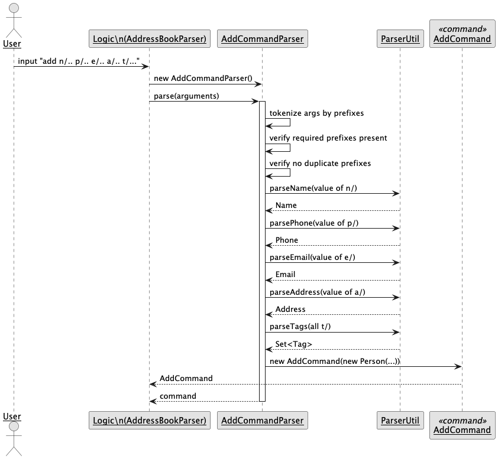
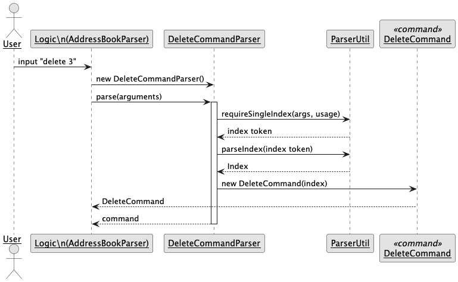
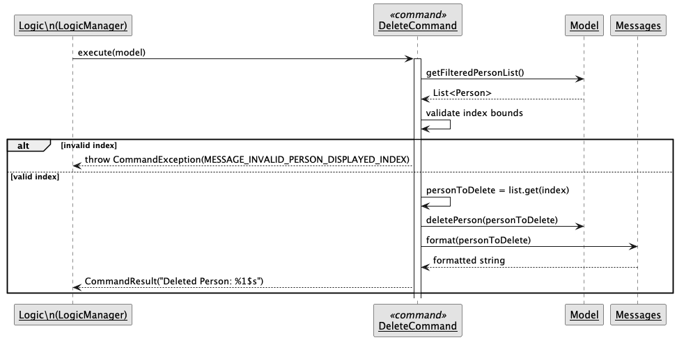

---
layout: page
title: ClassRosterPro Developer Guide
---
* Table of Contents
{:toc}
--------------------------------------------------------------------------------------------------------------------

## **Acknowledgements**

* This project is adapted from SE-EDU's AddressBook-Level3 (AB3). We reused its architecture, code structure, and portions of documentation with modifications to suit our domain. See: AB3 repository (`https://github.com/se-edu/addressbook-level3`), UG, and DG.
* The command-parsing pattern and some utility classes are reused from AB3 with changes. Parser overview diagram concept adapted from AB3 `ParserClasses`.
* PlantUML is used for UML diagrams. Graphviz is used for rendering.

--------------------------------------------------------------------------------------------------------------------

## **Setting up, getting started**

Refer to the guide [_Setting up and getting started_](SettingUp.md).

--------------------------------------------------------------------------------------------------------------------

## **Design**

### Architecture

The ***Architecture Diagram*** given above explains the high-level design of the App.

Given below is a quick overview of main components and how they interact with each other.

**Main components of the architecture**

**`Main`** (consisting of classes [`Main`](https://github.com/AY2526S1-CS2103T-W13-4/tp/blob/master/src/main/java/seedu/address/Main.java) and [`MainApp`](https://github.com/AY2526S1-CS2103T-W13-4/tp/blob/master/src/main/java/seedu/address/MainApp.java)) is in charge of the app launch and shut down.
* At app launch, it initializes the other components in the correct sequence, and connects them up with each other.
* At shut down, it shuts down the other components and invokes cleanup methods where necessary.

The bulk of the app's work is done by the following four components:

* [**`UI`**](#ui-component): The UI of the App.
* [**`Logic`**](#logic-component): The command executor.
* [**`Model`**](#model-component): Holds the data of the App in memory.
* [**`Storage`**](#storage-component): Reads data from, and writes data to, the hard disk.

[**`Commons`**](#common-classes) represents a collection of classes used by multiple other components.

**How the architecture components interact with each other**

The *Sequence Diagram* below shows how the components interact with each other for the scenario where the user issues the command `delete 1`.

Each of the four main components (also shown in the diagram above),

* defines its *API* in an `interface` with the same name as the Component.
* implements its functionality using a concrete `{Component Name}Manager` class (which follows the corresponding API `interface` mentioned in the previous point.

For example, the `Logic` component defines its API in the `Logic.java` interface and implements its functionality using the `LogicManager.java` class which follows the `Logic` interface. Other components interact with a given component through its interface rather than the concrete class (reason: to prevent outside component's being coupled to the implementation of a component), as illustrated in the (partial) class diagram below.

The sections below give more details of each component.

### UI component

The **API** of this component is specified in [`Ui.java`](https://github.com/AY2526S1-CS2103T-W13-4/tp/blob/master/src/main/java/seedu/address/ui/Ui.java)

The UI consists of a `MainWindow` that is made up of parts e.g.`CommandBox`, `ResultDisplay`, `PersonListPanel`, `StatusBarFooter` etc. All these, including the `MainWindow`, inherit from the abstract `UiPart` class which captures the commonalities between classes that represent parts of the visible GUI.

The `UI` component uses the JavaFx UI framework. The layout of these UI parts are defined in matching `.fxml` files that are in the `src/main/resources/view` folder. For example, the layout of the [`MainWindow`](https://github.com/se-edu/addressbook-level3/tree/master/src/main/java/seedu/address/ui/MainWindow.java) is specified in [`MainWindow.fxml`](https://github.com/se-edu/addressbook-level3/tree/master/src/main/resources/view/MainWindow.fxml)

The `UI` component,

* executes user commands using the `Logic` component.
* listens for changes to `Model` data so that the UI can be updated with the modified data.
* keeps a reference to the `Logic` component, because the `UI` relies on the `Logic` to execute commands.
* depends on some classes in the `Model` component, as it displays `Person` object residing in the `Model`.

### Logic component

**API** : [`Logic.java`](https://github.com/AY2526S1-CS2103T-W13-4/tp/blob/master/src/main/java/seedu/address/logic/Logic.java)

Here's a (partial) class diagram of the `Logic` component:

The sequence diagram below illustrates the interactions within the `Logic` component, taking `execute("delete 1")` API call as an example.

:information_source: **Note:** The lifeline for `DeleteCommandParser` should end at the destroy marker (X) but due to a limitation of PlantUML, the lifeline continues till the end of diagram.

How the `Logic` component works:

1. When `Logic` is called upon to execute a command, it is passed to an `AddressBookParser` object which in turn creates a parser that matches the command (e.g., `DeleteCommandParser`) and uses it to parse the command.
1. This results in a `Command` object (more precisely, an object of one of its subclasses e.g., `DeleteCommand`) which is executed by the `LogicManager`.
1. The command can communicate with the `Model` when it is executed (e.g. to delete a person). 
   Note that although this is shown as a single step in the diagram above (for simplicity), in the code it can take several interactions (between the command object and the `Model`) to achieve.
1. The result of the command execution is encapsulated as a `CommandResult` object which is returned back from `Logic`.

Here are the other classes in `Logic` (omitted from the class diagram above) that are used for parsing a user command:

How the parsing works:
* When called upon to parse a user command, the `AddressBookParser` class creates an `XYZCommandParser` (`XYZ` is a placeholder for the specific command name e.g., `AddCommandParser`) which uses the other classes shown above to parse the user command and create a `XYZCommand` object (e.g., `AddCommand`) which the `AddressBookParser` returns back as a `Command` object.
* All `XYZCommandParser` classes (e.g., `AddCommandParser`, `DeleteCommandParser`, ...) inherit from the `Parser` interface so that they can be treated similarly where possible e.g, during testing.

### Model component
**API** : [`Model.java`](https://github.com/AY2526S1-CS2103T-W13-4/tp/blob/master/src/main/java/seedu/address/model/Model.java)

The `Model` component,

* stores the address book data i.e., all `Person` objects (which are contained in a `UniquePersonList` object).
* stores the currently 'selected' `Person` objects (e.g., results of a search query) as a separate _filtered_ list which is exposed to outsiders as an unmodifiable `ObservableList<Person>` that can be 'observed' e.g. the UI can be bound to this list so that the UI automatically updates when the data in the list change.
* stores a `UserPref` object that represents the user’s preferences. This is exposed to the outside as a `ReadOnlyUserPref` objects.
* does not depend on any of the other three components (as the `Model` represents data entities of the domain, they should make sense on their own without depending on other components)

### Storage component

**API** : [`Storage.java`](https://github.com/AY2526S1-CS2103T-W13-4/tp/blob/master/src/main/java/seedu/address/storage/Storage.java)

The `Storage` component,
* can save both address book data and user preference data in JSON format, and read them back into corresponding objects.
* inherits from both `AddressBookStorage` and `UserPrefStorage`, which means it can be treated as either one (if only the functionality of only one is needed).
* depends on some classes in the `Model` component (because the `Storage` component's job is to save/retrieve objects that belong to the `Model`)

### Common classes

Classes used by multiple components are in the `seedu.address.commons` package.

--------------------------------------------------------------------------------------------------------------------

## **Implementation**

This section describes some noteworthy details on how certain features are implemented.

### Help Command

#### What it does

Shows the in-app help window with a curated command summary so tutors can quickly recall syntax without leaving the application.

#### Execution walkthrough

When a user enters `help`, `LogicManager` instantiates `HelpCommand`. The command returns a `CommandResult` that sets the `showHelp` flag to `true`, instructing the UI to open (or refocus) the help window. The textual summary displayed comes from `HelpCommand.SHOWING_HELP_MESSAGE`.

#### Design considerations

- Keep help content in code to guarantee the window works even when offline.
- The window opens idempotently—the same command simply refocuses the existing help stage instead of spawning duplicates.
- The `CommandResult` flagging approach keeps UI behaviour configurable without introducing UI dependencies into the logic layer.

### Add Command

#### What it does

Creates a new student entry with core contact information and optional tags. This is the primary way tutors build the roster.

#### Execution walkthrough

`AddressBookParser` delegates `add` commands to `AddCommandParser`, which tokenises by CLI prefixes, validates each mandatory field, and constructs a `Person`. `AddCommand#execute(Model)` then checks for duplicates via `model.hasPerson`; if none are found, `model.addPerson` is called and a success message is returned.

#### Design considerations

- Input validation happens during parsing so users see errors before the model is mutated.
- Duplicate detection relies on `Person#isSamePerson`, ensuring identity rules stay centralised in the model.
- For a detailed diagrammatic breakdown, see the subsequent **Add Student Command** section.

### List Command

#### What it does

Resets the student list back to the full roster after filters, searches, or attribute-based queries.

#### Execution walkthrough

`ListCommand#execute(Model)` invokes `model.updateFilteredPersonList(Model.PREDICATE_SHOW_ALL_PERSONS)`, restoring the observable list that backs the UI. The command then returns a simple confirmation message; no data is mutated.

#### Design considerations

- The command runs in O(n) because the filtered list wraps the master list—no deep copies are made.
- Display logic stays in the UI; `ListCommand` only manipulates the predicate to maintain separation of concerns.
- Returning an explicit acknowledgement helps the user confirm that the reset completed.

### Open Command

#### What it does

Expands a student's card in the UI so tutors can inspect lessons, grades, tags, and other extended details.

#### Execution walkthrough

`OpenCommand` resolves the target index against the current filtered list. It ensures the index is valid and that the card is not already expanded, then toggles the `Person`'s `expandedProperty` to `true`. The bound UI updates automatically and the command returns a confirmation message.

#### Design considerations

- Expansion state lives on the `Person` object, keeping UI behaviour consistent even when the list is resorted or filtered.
- Guard clauses prevent redundant state flips and provide clear error messages when the card is already open.
- Operations stay synchronous; no additional events or asynchronous callbacks are required.

### Close Command

#### What it does

Collapses an expanded student card to restore the compact list view.

#### Execution walkthrough

Similar to `OpenCommand`, `CloseCommand` validates the index, checks that the card is currently open, and flips the `expandedProperty` to `false`. A confirmation message indicates success; otherwise a descriptive error is thrown.

#### Design considerations

- Mirroring the open logic keeps the commands complementary and predictable.
- Using the same `expandedProperty` ensures toggling works regardless of how the card was opened (command or future UI triggers).
- Input validation reuses `Messages.MESSAGE_INVALID_PERSON_DISPLAYED_INDEX`, maintaining a consistent error vocabulary across commands.

### Clear Command

#### What it does

Wipes the entire roster, removing every stored student and resetting the dataset to a blank state.

#### Execution walkthrough

`ClearCommand#execute(Model)` constructs a new empty `AddressBook` instance and passes it to `model.setAddressBook(...)`. Because the model exposes an observable list, the UI immediately reflects the cleared roster. A confirmation message is returned to the user.

#### Design considerations

- The operation is destructive; users should be advised to back up data before running it. Undo is not available.
- Creating a fresh `AddressBook` is simpler than iterating through students, keeping the command O(1) relative to roster size.
- By reusing the setter in `Model`, storage and persistence layers automatically pick up the new state on the next save cycle.

### Exit Command

#### What it does

Terminates the application gracefully after acknowledging the user's request.

#### Execution walkthrough

`ExitCommand` returns a `CommandResult` with the `exit` flag set to `true`. `LogicManager` forwards this to the UI, which listens for the flag and triggers application shutdown while allowing final persistence tasks (e.g., saving preferences) to complete.

#### Design considerations

- The command never throws; exiting is always considered successful.
- Using flags in `CommandResult` keeps lifecycle management in the UI layer, avoiding logic-to-UI coupling.
- Any cleanup (saving logs, closing windows) can be centralised in the UI's response to the flag rather than scattered across commands.

### Add Student Command

#### What it does

Registers a new student in the roster. The created `Person` initially has empty remark, grade, and lesson lists; tags may be provided to group students immediately.

#### Parameters

`add n/NAME p/PHONE e/EMAIL a/ADDRESS [t/TAG]...`

- `n/` — required. Full student name; validated by `Name#isValidName`.
- `p/` — required. Contact number; must satisfy `Phone#isValidPhone`.
- `e/` — required. Email address; checked by `Email#isValidEmail`.
- `a/` — required. Free-form postal address.
- `t/` — optional, repeatable. Adds tags; each value must satisfy `Tag#isValidTagName`.

The command rejects missing mandatory prefixes, duplicate occurrences of the same mandatory prefix, and malformed values.

#### Overview

The `add` command follows the standard command pattern of *parse → construct command → execute on the model*.

#### High-level flow

The activity diagram captures the user journey: the tutor submits the command, the system validates the input, and either reports a duplicate or persists the new student before confirming success.

#### Parsing pipeline

The sequence diagram shows how control moves from `LogicManager` to `AddressBookParser` and finally to `AddCommandParser`. The parser:

1. Tokenises the raw arguments by prefixes (`n/`, `p/`, `e/`, `a/`, `t/`).
2. Ensures the preamble is empty and every mandatory prefix appears exactly once.
3. Delegates to `ParserUtil` to construct domain objects (`Name`, `Phone`, `Email`, `Address`, `Tag`).
4. Builds a `Person` with default `Remark`, `LessonList`, and `GradeList`, and returns a fully initialised `AddCommand`.

Key classes: `AddCommandParser`, `ParserUtil`, `Person`.

#### Execution behaviour

The sequence diagram documents the runtime checks when `AddCommand#execute(Model)` is invoked. The command:

1. Calls `model.hasPerson(toAdd)` to guard against duplicates.
2. Throws `CommandException` with `MESSAGE_DUPLICATE_PERSON` if a match exists.
3. Otherwise adds the student via `model.addPerson(toAdd)` and formats the success message through `Messages.format`.

Key classes: `AddCommand`, `Model`, `Messages`.

#### Validation and error handling

- Missing or repeated mandatory prefixes trigger `ParseException` with usage guidance.
- Invalid value formats (e.g., phone, email) are rejected by the respective domain constructors inside `ParserUtil`.
- Duplicate students—based on the `Person#isSamePerson` identity definition—are blocked during execution.

### Edit Student Command

#### What it does

Updates selected fields of an existing student without replacing the whole entry. Fields omitted from the command remain unchanged.

#### Parameters

`edit INDEX [n/NAME] [p/PHONE] [e/EMAIL] [a/ADDRESS] [t/TAG]... [attr/KEY=VALUE]...`

- `INDEX` — required, 1-based. Identifies the student in the current filtered list.
- `n/`, `p/`, `e/`, `a/` — optional single-occurrence fields; if present, must pass the same validators as `add`.
- `t/` — optional, repeatable; replaces the tag set when provided. Supplying a lone `t/` clears all tags.
- `attr/` — optional, repeatable; replaces the attribute set. Supplying `attr/` with an empty value clears attributes.

At least one field beyond the index must be provided; otherwise the command rejects the input.

#### Overview

The edit command follows the same *parse → command → execute* pattern as other logic features.

#### High-level flow

The activity diagram illustrates the conditional checks: field presence, index validation, duplicate detection, and final update.

#### Parsing pipeline

The sequence diagram shows how `AddressBookParser` delegates to `EditCommandParser`. The parser:

1. Tokenises optional fields and isolates the index preamble.
2. Verifies that at least one editable field was supplied.
3. Parses the index and checks for duplicate single-use prefixes.
4. Builds an `EditPersonDescriptor`, parsing tags and attributes through `ParserUtil`.
5. Ensures the descriptor contains changes before instantiating `EditCommand`.

Key classes: `EditCommandParser`, `EditPersonDescriptor`, `ParserUtil`.

#### Execution behaviour

The sequence diagram  captures the runtime flow:

1. Fetch the targeted student from the filtered list and guard against invalid indices.
2. Produce an edited `Person` by merging descriptor values with the original.
3. If the identity changes and clashes with another student, throw `MESSAGE_DUPLICATE_PERSON`.
4. Otherwise replace the entry, refresh the list, and return a success message.

Key classes: `EditCommand`, `Model`, `Messages`.

#### Validation and error handling

- Missing optional fields trigger `MESSAGE_NOT_EDITED`.
- Invalid indices reuse the shared index error message.
- Identity conflicts are blocked before the model is mutated.

### Delete Student Command

#### What it does

Removes a student from the roster using their displayed index.

#### Parameters

`delete INDEX`

- `INDEX` — required, 1-based. Must reference an entry in the current filtered list.

#### Overview

Deletion is the simplest command flow: parse the index, resolve it against the filtered list, and delete the matching person.

#### High-level flow

The activity diagram highlights the single decision point—whether the supplied index is valid.

#### Parsing pipeline

The sequence diagram  shows the brief parser interaction: `requireSingleIndex`, `parseIndex`, then creation of a `DeleteCommand`.

Key classes: `DeleteCommandParser`, `ParserUtil`.

#### Execution behaviour

The sequence diagram  depicts the execution: retrieve the filtered list, guard against invalid indices, remove the student through `model.deletePerson`, and format a confirmation message with `Messages.format`. Key classes: `DeleteCommand`, `Model`, `Messages`.

#### Validation and error handling

- Invalid indices throw `MESSAGE_INVALID_PERSON_DISPLAYED_INDEX`.
- Because the command is irreversible, consider pairing it with undo when available.

### Mark Student Attendance Command

#### What it does

Marks a student's attendance for a specific lesson as 'present'. This helps tutors keep an accurate record of class attendance, which is essential for tracking student records and for billing purposes.

#### Parameters

`mark INDEX lesson/LESSON_INDEX`

-   `INDEX` — required, 1-based. Identifies the student in the current filtered list.
-   `LESSON_INDEX` — required, 1-based. Identifies the lesson in the student's lesson list, which is visible when the student's card is expanded.

#### Overview

The `mark` command follows the standard command pattern of *parse → construct command → execute on the model*. It is designed to be a quick and straightforward way to update a single lesson's attendance.

#### High-level flow

!Mark command activity

The activity diagram shows the user's journey: the tutor provides the student and lesson indices, the system validates them, checks if the lesson is already marked, and then updates the attendance status before confirming success.

#### Parsing pipeline

!Mark command parser sequence

The sequence diagram shows how `AddressBookParser` delegates to `MarkCommandParser`. The parser:

1.  Tokenises the arguments to find the person `INDEX` and the `lesson/LESSON_INDEX`.
2.  Uses `ParserUtil` to parse both indices into `Index` objects.
3.  Ensures both indices are present and valid.
4.  Instantiates and returns a fully initialised `MarkCommand`.

Key classes: `MarkCommandParser`, `ParserUtil`.

#### Execution behaviour

!Mark command execution sequence

The sequence diagram documents the runtime checks when `MarkCommand#execute(Model)` is invoked. The command:

1.  Retrieves the target `Person` from the filtered list using the person index.
2.  Retrieves the target `Lesson` from the person's `LessonList` using the lesson index.
3.  Checks if the lesson is already marked as present. If so, it throws a `CommandException` with `MESSAGE_LESSON_ALREADY_MARKED`.
4.  Creates a new `Lesson` object with the same details but with its attendance status set to `true`.
5.  Creates a new `Person` object with the updated `LessonList`.
6.  Calls `model.setPerson(...)` to replace the old person object with the new one, and returns a success message.

Key classes: `MarkCommand`, `Model`, `Person`, `Lesson`, `LessonList`.

#### Validation and error handling

-   Invalid or missing student `INDEX` throws `MESSAGE_INVALID_PERSON_DISPLAYED_INDEX`.
-   Invalid or missing `LESSON_INDEX` throws `MESSAGE_INVALID_LESSON_DISPLAYED_INDEX`.
-   Attempting to mark a lesson that is already marked as present throws `MESSAGE_LESSON_ALREADY_MARKED`.

#### Design Considerations

-   **Immutability**: The command creates new `Lesson` and `Person` objects instead of mutating existing ones. This aligns with the functional programming paradigm and makes state management more predictable.
-   **Idempotency Check**: The check for whether a lesson is already marked prevents redundant operations and provides clear feedback to the user, avoiding confusion.
-   **User Experience**: The command requires two separate indices, which is clear but requires the user to first identify the student and then the specific lesson. This is a trade-off for precision.
-   **Flexibility**: The command intentionally allows marking lessons in the past, present, or future. This gives tutors the flexibility to catch up on old attendance records or pre-mark attendance for a known upcoming attendance.

### Unmark Student Attendance Command

#### What it does

Reverts a student's attendance for a specific lesson to 'not present'. This is useful for correcting mistakes made during attendance-taking.

#### Parameters

`unmark INDEX lesson/LESSON_INDEX`

-   `INDEX` — required, 1-based. Identifies the student in the current filtered list.
-   `LESSON_INDEX` — required, 1-based. Identifies the lesson in the student's lesson list.

#### Overview

The `unmark` command is the direct counterpart to the `mark` command and follows the same *parse → command → execute* pattern. Its primary function is to reverse an attendance mark.

#### High-level flow

!Unmark command activity

The activity diagram illustrates the flow for unmarking a lesson, which mirrors the `mark` command's logic: validate indices, check the current state, update the lesson, and confirm the change.

#### Parsing pipeline

!Unmark command parser sequence

The sequence diagram shows `AddressBookParser` delegating to `UnmarkCommandParser`. The parser:

1.  Parses the person `INDEX` from the preamble.
2.  Parses the `lesson/LESSON_INDEX` from the prefixed arguments.
3.  Uses `ParserUtil` to validate and create `Index` objects for both.
4.  Constructs and returns an `UnmarkCommand` with the parsed indices.

Key classes: `UnmarkCommandParser`, `ParserUtil`.

#### Execution behaviour

!Unmark command execution sequence

The sequence diagram captures the runtime flow of `UnmarkCommand#execute(Model)`. The command:

1.  Retrieves the target `Person` and `Lesson` using the provided indices.
2.  Guards against invalid indices by throwing a `CommandException` if either is out of bounds.
3.  Checks if the lesson is already marked as 'not present'. If so, it throws a `CommandException` with `MESSAGE_LESSON_ALREADY_UNMARKED`.
4.  Creates a new `Lesson` with its attendance status set to `false`.
5.  Creates a new `Person` with the updated `LessonList`.
6.  Updates the model via `model.setPerson(...)` and returns a success message confirming the change.

Key classes: `UnmarkCommand`, `Model`, `Person`, `Lesson`, `LessonList`.

#### Validation and error handling

-   Invalid student `INDEX` throws `MESSAGE_INVALID_PERSON_DISPLAYED_INDEX`.
-   Invalid `LESSON_INDEX` throws `MESSAGE_INVALID_LESSON_DISPLAYED_INDEX`.
-   Attempting to unmark a lesson that is already 'not present' throws `MESSAGE_LESSON_ALREADY_UNMARKED`.

#### Design Considerations

-   **Symmetry with `mark`**: The command's structure, validation, and execution flow are intentionally symmetric with `MarkCommand` to ensure a consistent and predictable developer and user experience.
-   **Error-Correction Focus**: This command serves as a simple and direct way to correct errors, which is a critical usability feature for data entry applications.
-   **State-Awareness**: By checking if the lesson is already unmarked, the command avoids unnecessary model updates and provides precise feedback, preventing user confusion about the state of the data.
-   **Flexibility**: Mirroring the `mark` command, `unmark` also works on past, present, and future lessons. This is crucial for correcting historical attendance errors or adjusting plans for future lessons.

### Grade Command

#### What it does

Adds or updates grades for a student by subject and assessment. This enables tutors to maintain a detailed grade book per student, tracking performance across different subjects and assessment types over time.

#### Parameters

`grade INDEX sub/SUBJECT/ASSESSMENT/SCORE [sub/SUBJECT2/ASSESSMENT2/SCORE2]…`

- `INDEX` — required, 1-based. Identifies the student in the current filtered list.
- `sub/SUBJECT/ASSESSMENT/SCORE` — required, at least one. Each triplet specifies a grade entry:
  - `SUBJECT` — subject name (e.g., MATH, SCIENCE); validated for format.
  - `ASSESSMENT` — assessment type (e.g., WA1, Quiz1); validated for format.
  - `SCORE` — numeric score; validated to be a valid score value.

#### Overview

The `grade` command follows the standard command pattern of *parse → construct command → execute on the model*. It supports adding or updating multiple grades in a single command. If a subject-assessment combination already exists for the student, the new score overwrites the existing one.

#### High-level flow

1. User provides student index and one or more grade triplets.
2. System validates index and parses each grade triplet.
3. System detects and prevents duplicate subject-assessment pairs within the same command.
4. System updates the student's grade list and confirms success.

#### Parsing pipeline

`AddressBookParser` delegates `grade` commands to `GradeCommandParser`. The parser:

1. Tokenises arguments using the `sub/` prefix to extract all grade triplets.
2. For each triplet, splits by `/` to separate subject, assessment, and score.
3. Validates each component (non-empty, proper format).
4. Tracks seen subject-assessment pairs using a `HashSet` to detect duplicates within the command.
5. Throws `ParseException` if duplicates are detected or if validation fails.
6. Parses the student index from the preamble.
7. Constructs `Grade` objects and returns a `GradeCommand` with the index and set of grades.

Key classes: `GradeCommandParser`, `ParserUtil`, `Grade`.

#### Execution behaviour

When `GradeCommand#execute(Model)` is invoked, the command:

1. Retrieves the target `Person` from the filtered list using the index.
2. Guards against invalid indices by throwing `CommandException` if out of bounds.
3. Iterates through the grades to add, calling `GradeList#addGrade` for each.
4. Creates a new `Person` with the updated `GradeList`.
5. Updates the model via `model.setPerson(...)` and returns a success message with the updated grades.

Key classes: `GradeCommand`, `Model`, `Person`, `GradeList`, `Grade`.

#### Validation and error handling

- Invalid or missing student `INDEX` throws `MESSAGE_INVALID_PERSON_DISPLAYED_INDEX`.
- Missing or malformed grade triplets (missing parts, wrong format) throw `ParseException` with specific guidance.
- Duplicate subject-assessment pairs within the same command throw `ParseException` with a descriptive error message.
- Invalid subject, assessment, or score formats throw `ParseException` during parsing.

#### Design Considerations

- **Duplicate Prevention**: Duplicate detection at the parser level prevents ambiguous behavior and provides immediate feedback before model mutation.
- **Overwrite Behavior**: Existing grades with the same subject-assessment combination are overwritten, following the principle that the latest data is authoritative.
- **Immutability**: The command creates new `GradeList` and `Person` objects, maintaining immutability and predictable state management.
- **Batch Operations**: Supporting multiple grades per command improves efficiency when recording several assessments at once.

### Delete Grade Command

#### What it does

Removes a specific grade entry (identified by subject and assessment) from a student's grade list. This enables tutors to correct mistakes, such as accidentally recording a grade for a test a student did not take.

#### Parameters

`delgrade INDEX sub/SUBJECT/ASSESSMENT`

- `INDEX` — required, 1-based. Identifies the student in the current filtered list.
- `sub/SUBJECT/ASSESSMENT` — required. Specifies which grade to remove:
  - `SUBJECT` — subject name (must match exactly).
  - `ASSESSMENT` — assessment type (must match exactly).

#### Overview

The `delgrade` command follows the standard command pattern of *parse → construct command → execute on the model*. It is the inverse operation to the `grade` command, allowing tutors to maintain accurate grade records by removing erroneous entries.

#### High-level flow

1. User provides student index and subject-assessment identifier.
2. System validates index and parses the subject-assessment pair.
3. System checks if the grade exists for the student.
4. System removes the grade and confirms success.

#### Parsing pipeline

`AddressBookParser` delegates `delgrade` commands to `DeleteGradeCommandParser`. The parser:

1. Tokenises arguments using the `sub/` prefix.
2. Extracts the index from the preamble.
3. Splits the `sub/` value by `/` to separate subject and assessment.
4. Validates that both subject and assessment are non-empty.
5. Constructs and returns a `DeleteGradeCommand` with the index, subject, and assessment.

Key classes: `DeleteGradeCommandParser`, `ParserUtil`.

#### Execution behaviour

When `DeleteGradeCommand#execute(Model)` is invoked, the command:

1. Retrieves the target `Person` from the filtered list using the index.
2. Guards against invalid indices by throwing `CommandException` if out of bounds.
3. Checks if the grade exists using `GradeList#hasGrade(subject, assessment)`.
4. Throws `CommandException` with `MESSAGE_GRADE_NOT_FOUND` if the grade does not exist.
5. Creates a new `Person` with the grade removed via `GradeList#removeGrade(subject, assessment)`.
6. Updates the model via `model.setPerson(...)` and returns a success message.

Key classes: `DeleteGradeCommand`, `Model`, `Person`, `GradeList`.

#### Validation and error handling

- Invalid or missing student `INDEX` throws `MESSAGE_INVALID_PERSON_DISPLAYED_INDEX`.
- Missing or malformed `sub/` prefix throws `ParseException` with usage guidance.
- Empty subject or assessment throws `ParseException`.
- Non-existent grade throws `CommandException` with `MESSAGE_GRADE_NOT_FOUND`.

#### Design Considerations

- **Error Prevention**: Checking for grade existence before removal provides clear feedback and prevents silent failures.
- **Immutability**: The command creates new `GradeList` and `Person` objects, maintaining immutability consistent with other commands.
- **Precision**: Requiring exact subject-assessment match ensures tutors remove the intended grade without ambiguity.
- **Symmetry**: The command complements the `grade` command, providing complete CRUD operations for grade management.

### Filter Command

#### What it does

Filters and displays students whose attributes match specified criteria. This enables tutors to quickly find students matching specific attributes, such as all students in a particular subject or age group, using AND logic between different attributes and OR logic within the same attribute.

#### Parameters

`filter attr/KEY=VALUE[,VALUE2]… [attr/KEY2=VALUE2]…`

- `attr/KEY=VALUE` — required, at least one. Specifies an attribute filter:
  - `KEY` — attribute key (e.g., subject, age); case-insensitive.
  - `VALUE` — attribute value(s); multiple values separated by commas; case-insensitive.
- Multiple `attr/` prefixes can be provided for AND logic between different keys.

#### Overview

The `filter` command follows the standard command pattern of *parse → construct command → execute on the model*. It updates the filtered list predicate without mutating the underlying data, allowing the UI to display only matching students.

#### High-level flow

1. User provides one or more attribute filters.
2. System parses each filter, extracting keys and values.
3. System constructs an `AttributeContainsPredicate` with the filter criteria.
4. System applies the predicate to the filtered list and displays matching students with a count.

#### Parsing pipeline

`AddressBookParser` delegates `filter` commands to `FilterCommandParser`. The parser:

1. Tokenises arguments using the `attr/` prefix to extract all attribute filters.
2. For each filter, splits by `=` to separate key and value(s).
3. Validates that the key is non-empty.
4. Splits comma-separated values and adds them to a set for the corresponding key.
5. Validates that at least one value exists for each key.
6. Constructs an `AttributeContainsPredicate` with the parsed attribute filters.
7. Returns a `FilterCommand` with the predicate.

Key classes: `FilterCommandParser`, `AttributeContainsPredicate`.

#### Execution behaviour

When `FilterCommand#execute(Model)` is invoked, the command:

1. Updates the filtered list predicate via `model.updateFilteredPersonList(predicate)`.
2. Retrieves the filtered list size.
3. Returns a success message with the count of matching students.

Key classes: `FilterCommand`, `Model`, `AttributeContainsPredicate`.

#### Validation and error handling

- Missing `attr/` prefix throws `ParseException` with usage guidance.
- Malformed attribute format (missing `=`) throws `ParseException`.
- Empty attribute key throws `ParseException`.
- Empty attribute values (after trimming and filtering) throws `ParseException`.
- At least one `attr/` prefix must be provided.

#### Design Considerations

- **Predicate-Based Filtering**: Using a predicate allows the filtered list to automatically update when underlying data changes, maintaining consistency.
- **AND/OR Logic**: AND logic between different attribute keys and OR logic within the same key provides intuitive filtering behavior for tutors.
- **Case Insensitivity**: Both keys and values are matched case-insensitively, reducing user frustration from capitalization mismatches.
- **No Data Mutation**: The command only updates the view predicate; no student data is modified, making it safe and reversible via the `list` command.
- **Performance**: Filtering is efficient as it leverages JavaFX `FilteredList`, which wraps the master list without creating deep copies.

--------------------------------------------------------------------------------------------------------------------

## **Documentation, logging, testing, configuration, dev-ops**

* [Documentation guide](Documentation.md)
* [Testing guide](Testing.md)
* [Logging guide](Logging.md)
* [Configuration guide](Configuration.md)
* [DevOps guide](DevOps.md)

--------------------------------------------------------------------------------------------------------------------

## **Appendix: Requirements**

## **1. Product Scope (Target User & Value Proposition)**

### **Target User Profile**

Private tutors who manage many students without the infrastructure of a tuition agency and need a fast, keyboard-driven desktop tool to keep contacts, lessons, attendance, grades, and notes organized.

### **Value Proposition**

ClassRosterPro reduces tutors' admin load by consolidating contacts, tagging/filtering, lesson scheduling, attendance tracking, grade recording, and quick search into one command-first desktop app—so time goes to teaching, not record-keeping.

---

## **2. User Stories (with MoSCoW Priorities)**

| Priority | As a …   | I want to …                                                                  | So that I can …                                                                                 |
| -------- | -------- |------------------------------------------------------------------------------| ----------------------------------------------------------------------------------------------- |
| ***      | New user | Access the help page                                                         | Familiarise myself with the commands available in the program                                   |
| ***      | Tutor    | Add a new student contact                                                    | Easily contact them for class updates                                                           |
| ***      | Tutor    | Delete a student contact                                                     | Keep my contacts updated                                                                        |
| ***      | Tutor    | Edit a student's contact details                                             | Update their information when it changes                                                        |
| ***      | Tutor    | Search for a student contact by name                                         | Quickly find their contact                                                                      |
| ***      | Tutor    | Tag and filter students by their attributes (e.g. class, subject, age, etc.) | Categorise students with similar attributes and look them up more easily                        |
| ***      | Tutor    | Delete specific attributes from students                                     | Remove outdated or incorrect information                                                        |
| ***      | Tutor    | Schedule lessons for students                                                | Keep track of upcoming classes and avoid scheduling conflicts                                   |
| ***      | Tutor    | Unschedule lessons                                                           | Remove cancelled or rescheduled lessons from my roster                                          |
| ***      | Tutor    | Record student attendance for specific lessons                               | Track which students attended which classes                                                     |
| ***      | Tutor    | Unmark attendance                                                            | Correct attendance records if marked incorrectly                                                |
| ***      | Tutor    | Record grades for students by subject and assessment                         | Maintain a detailed grade book for each student                                                 |
| ***      | Tutor    | Open/close student contact cards                                             | View detailed or summary information as needed                                                  |
| **       | Tutor    | List all students (reset filters)                                            | Always return to the full view                                                                  |
| **       | Tutor    | Tag with multi-values (e.g., subject=math,science)                           | Group students flexibly by multiple criteria                                                    |
| **       | Tutor    | Use quick search by name, email, or phone                                    | Instantly find students during lessons                                                          |
| **       | Tutor    | See search counts (e.g., "2 students found")                                 | Get quick feedback on filter results                                                            |

### **Could-Have**

* Undo/redo last action to recover from mistakes (in backlog; aligns with productivity)
* Export/import roster to a file for backup
* Bulk updates for multiple students

### **Considered (Not for current release)**

* Calendar sync with external providers
* Dashboard analytics (future epics)
* Automated reminders for upcoming lessons

---

## **3. Representative Use Cases**

### **UC01: Add attributes to a student**

**System:** ClassRosterPro\
**Use Case:** UC01 - Add attributes to students\
**Actor:** Tutor\
**Preconditions:** None\
**Guarantees:**
  - Student is added to roster if all fields are valid and no duplicate exists
  - Attributes are added to student if index is valid and attribute format is correct

**MSS:**

1. Tutor enters add command with student details. 
2. ClassRosterPro validates all fields and adds the student.
3. Tutor enters addattr command with index and attribute.
4. ClassRosterPro adds the new attribute values to the student.\
   Use case ends. 

**Extensions:**

* 1a. Tutor enters invalid email/phone number. 
  * 1a1. ClassRosterPro shows error message and rejects the command.\
    Use case ends.
* 1b. Tutor enters duplicate contact.
  * 1b1. ClassRosterPro shows error "This person already exists in the address book".\
    Use case ends.
* 3a. Tutor enters invalid index.
  * 3a1. ClassRosterPro shows "The person index provided is invalid".\  
    Use case ends.
* 3b.  Tutor enters invalid attribute format.
  * 3b1. ClassRosterPro shows "Incorrect format for attributes" with usage example.\
    Use case ends.
* a. At any time, Tutor enters exit command.
    * a1. ClassRosterPro saves data and exits.\
    Use case ends.
---

### **UC02 - Schedule Lesson for Student**

**System:** ClassRosterPro\
**Use Case:** UC02 - Schedule Lesson for Student\
**Actor:** Tutor\
**Preconditions:** Student exists in the roster\
**Guarantees:** Lesson is scheduled if no overlaps/duplicates and all validations pass

**MSS:**

1. Tutor enters schedule command with lesson details.
2. ClassRosterPro validates index, time format, date format, and time validity.
3. ClassRosterPro checks for overlapping lessons on the same date.
4. ClassRosterPro saves and confirms the lesson.\
   Use case ends.

**Extensions:**

* 2a. ClassRosterPro detects invalid time format.
  * 2a1. ClassRosterPro shows "Invalid start/end time format. Use HH:mm".\
    Use case ends.
* 2b. ClassRosterPro detects invalid time values.
  * 2b1. ClassRosterPro shows "Invalid time. Hours must be 00-23 and minutes must be 00-59".\
    Use case ends.
* 2c. ClassRosterPro detects invalid date format.
   * 2c1. ClassRosterPro shows "Invalid date format. Use YYYY-MM-DD".\
     Use case ends.
* 2d. ClassRosterPro detects invalid date values (e.g., 2025-11-31).
   * 2d1. ClassRosterPro shows "Invalid date. Ensure the day is valid for the given month and year".\
     Use case ends.
* 2e. ClassRosterPro detects end time ≤ start time.
   * 2e1. ClassRosterPro shows "End time must be after start time".\
     Use case ends.
* 2f. ClassRosterPro detects missing required fields.
   * 2f1. ClassRosterPro shows error message indicating which fields are missing.\
     Use case ends.
* 3a. ClassRosterPro detects lesson overlaps with existing lesson.
   * 3a1. ClassRosterPro shows "This lesson overlaps with an existing lesson".\
     Use case ends.
* 3b. ClassRosterPro detects duplicate lesson (exact match).
   * 3b1. ClassRosterPro shows "This lesson already exists".\
     Use case ends.
---

### **UC03 - Record Attendance for Lesson**

**System:** ClassRosterPro\
**Use Case:** UC03 - Record Attendance for Lesson\
**Actor:** Tutor\
**Preconditions:** Student exists with at least one scheduled lesson\
**Guarantees:** Attendance is recorded if both indices are valid and lesson isn't already marked

**MSS:**

1. Tutor enters mark command with student index and lesson index.
2. ClassRosterPro validates both indices.
3. ClassRosterPro marks the lesson as attended.
4. ClassRosterPro updates attendance count and confirms.\
   Use case ends.

**Extensions:**
* 2a. ClassRosterPro detects invalid student index.
  * 2a1. ClassRosterPro shows "Invalid person index".\
    Use case ends.
* 2b. ClassRosterPro detects invalid lesson index.
  * 2b1. ClassRosterPro shows "Invalid lesson index".\
    Use case ends.
* 2c. ClassRosterPro detects lesson already marked.
  * 2c1. ClassRosterPro shows "This lesson has already been marked".\
    Use case ends.

---

### **UC04 - Record Grades for Student**

**System:** ClassRosterPro\
**Use Case:** UC04 - Record Grades for Student\
**Actor:** Tutor\
**Preconditions:** Student exists in the roster\
**Guarantees:**
- Grades are saved with proper validation
- Existing subject-assessment records are overwritten with new scores
- Data integrity is maintained

**MSS:**

1. Tutor enters grade command with student index and grade details.
2. ClassRosterPro validates index and grade format. 
3. ClassRosterPro saves grades and confirms.\
  Use case ends.

**Extensions:**

* 1a. Tutor enters invalid command format.
   * 1a1. ClassRosterPro shows correct usage format.\
     Use case ends.
* 2a. ClassRosterPro detects invalid index.
   * 2a1. ClassRosterPro shows "Invalid person index".\
     Use case ends.
* 2b. ClassRosterPro detects invalid grade format.
   * 2b1. ClassRosterPro shows "Incorrect format".\
     Use case ends.
* 2c. ClassRosterPro detects subject/assessment/score empty.
   * 2c1. ClassRosterPro shows error message indicating missing components.\
     Use case ends.
* 2d. ClassRosterPro detects duplicate subject-assessment in command.
   * 2d1. ClassRosterPro shows error message indicating duplicate grade detected.\
     Use case ends.
* 2e. ClassRosterPro detects invalid score value.
   * 3a1. ClassRosterPro shows "Error saving grade data".\
     Use case ends.

---

### **UC04a - Delete Grade from Student**

**System:** ClassRosterPro\
**Use Case:** UC04a - Delete Grade from Student\
**Actor:** Tutor\
**Preconditions:** Student exists in the roster with at least one grade\
**Guarantees:**
- Grade is removed if index and subject-assessment are valid
- Data integrity is maintained
- Error message displayed if grade does not exist

**MSS:**

1. Tutor enters delgrade command with student index and subject-assessment identifier.
2. ClassRosterPro validates index and subject-assessment format.
3. ClassRosterPro checks if the grade exists.
4. ClassRosterPro removes the grade and confirms.\
  Use case ends.

**Extensions:**

* 1a. Tutor enters invalid command format.
   * 1a1. ClassRosterPro shows correct usage format.\
     Use case ends.
* 2a. ClassRosterPro detects invalid index.
   * 2a1. ClassRosterPro shows "Invalid person index".\
     Use case ends.
* 2b. ClassRosterPro detects invalid format (missing subject or assessment).
   * 2b1. ClassRosterPro shows "Use sub/SUBJECT/ASSESSMENT".\
     Use case ends.
* 3a. ClassRosterPro detects grade does not exist.
   * 3a1. ClassRosterPro shows "Grade not found".\
     Use case ends.
* 4a. ClassRosterPro encounters storage error during removal.
   * 4a1. ClassRosterPro shows "Error removing grade data".\
     Use case ends.

---

### **UC05 - Unschedule Lesson**

**System**: ClassRosterPro\
**Use Case**: UC05 - Unschedule Lesson\
**Actor**: Tutor\
**Preconditions**: Student exists with at least one scheduled lesson\
**Guarantees**:
- Lesson is removed if both indices are valid
- Attendance records for the lesson are also removed
- Data consistency is maintained

**MSS:**

1. Tutor lists/filters students.
2. Tutor enters unschedule command with student index and lesson index.
3. ClassRosterPro validates both indices.
4. ClassRosterPro removes the lesson and confirms.\
  Use case ends.

**Extensions:**

* 1a. Tutor cannot find desired student in current view.
   * 1a1. Tutor uses find or filter commands to locate student.\
     Use case resumes from step 1.
* 2a. Tutor enters invalid command format.
   * 2a1. ClassRosterPro shows correct usage format.\
     Use case ends.
* 3a. ClassRosterPro detects student index out of bounds.
   * 3a1. ClassRosterPro shows "Invalid person index".\
     Use case ends.
* 3b. ClassRosterPro detects lesson index out of bounds.
   * 3b1. ClassRosterPro shows "Invalid lesson index".\
     Use case ends.
* 3c. ClassRosterPro detects student has no lessons.
   * 3c1. ClassRosterPro shows "The selected person has no lessons scheduled".\
     Use case ends.
* 4a. ClassRosterPro encounters data corruption in lesson records.
   * 4a1. ClassRosterPro shows "Error accessing lesson data".\
     Use case ends.
* 4b. ClassRosterPro fails to remove lesson due to storage error.
   * 4b1. ClassRosterPro shows "Error removing lesson data".\
     Use case ends.

---

### **UC06 - Delete Attributes from Student**

**System**: ClassRosterPro\
**Use Case**: UC06 - Delete Attributes from Student\
**Actor**: Tutor\
**Preconditions**: Student exists with at least one attribute\
**Guarantees**:
- Specified attributes are removed if they exist
- Non-existent attributes are ignored
- Data integrity is maintained

**MSS:**

1. Tutor enters delattr command with student index and attribute keys.
2. ClassRosterPro validates index and attribute keys.
3. ClassRosterPro removes the specified attributes and confirms.\
   Use case ends.

**Extensions:**

* 1a. Tutor enters invalid command format.
   * 1a1. ClassRosterPro shows correct usage format.\
     Use case ends.
* 2a. ClassRosterPro detects invalid index.
   * 2a1. ClassRosterPro shows "Invalid person index".\
     Use case ends.
* 2b. ClassRosterPro detects attribute doesn't exist.
   * 2b1. ClassRosterPro shows "No matching attributes found".\
     Use case ends.
* 2c. ClassRosterPro detects multiple attributes specified.
   * 2c1. ClassRosterPro removes all valid attributes and proceeds.\
     Use case ends.
* 2d. ClassRosterPro detects no attributes specified.
   * 2d1. ClassRosterPro shows error "No attributes specified for deletion".\
     Use case ends.
* 3a. ClassRosterPro encounters storage error during removal.
    * 3a1. ClassRosterPro shows "Error removing attribute data".\
     Use case ends.
---

### **UC07 - Filter Students by Attributes**

**System**: ClassRosterPro\
**Use Case**: UC07 - Filter Students by Attributes\
**Actor**: Tutor\
**Preconditions**: None\
**Guarantees**: Students matching filter criteria are displayed with count

**MSS:**

1. Tutor enters filter command with attribute criteria.
2. ClassRosterPro applies filters using AND logic between attributes and OR logic within same attribute.
3. ClassRosterPro displays filtered list with count.\
   Use case ends.

**Extensions:**

* 1a. No students match filter criteria.
   * 1a1. ClassRosterPro displays "0 students listed".\
     Use case ends.
* 2a. ClassRosterPro detects invalid age value (non-integer).
    * 2a1. ClassRosterPro shows error message.\
     Use case ends.
* 2b. ClassRosterPro detects no attr/ prefix provided.
   * 2b1. ClassRosterPro shows "Incorrect format".\
     Use case ends.

---

### **UC08 - Search Student**

**System**: ClassRosterPro\
**Use Case**: UC08 - Search Student\
**Actor**: Tutor\
**Preconditions**: None\
**Guarantees**: Students matching search criteria in name, phone, or email are displayed

**MSS:**

1. Tutor types search query in search box.
2. ClassRosterPro searches name, phone, and email fields in real-time.
3. ClassRosterPro displays matching results.\
   Use case ends.

**Extensions:**

* 1a. No matches found.
   * 1a1. ClassRosterPro displays empty list.\
     Use case ends.
* 2a. Search query is cleared.
   * 2a1. ClassRosterPro returns to full list.\
     Use case ends.

---

### **UC09 - Delete Student**

**System**: ClassRosterPro\
**Use Case**: UC09 - Delete Student\
**Actor**: Tutor\
**Preconditions**: Student exists in roster\
**Guarantees**: Student is permanently removed from roster

**MSS:**

1. Tutor lists/filters students.
2. Tutor enters delete command with student index.
3. ClassRosterPro validates index and removes the contact.
4. ClassRosterPro confirms deletion.\
   Use case ends.

**Extensions:**

* 2a. ClassRosterPro detects index out of bounds.
   * 2a1. ClassRosterPro shows "Invalid person index".\
     Use case ends.
* 2b. ClassRosterPro detects index not a positive integer.
   * 2b1. ClassRosterPro shows error message.\
     Use case ends.

---
### **UC10 - Unmark Attendance for Lesson**

**System**: ClassRosterPro\
**Use Case**: UC10 - Unmark Attendance for Lesson\
**Actor**: Tutor\
**Preconditions**: Student exists with at least one scheduled lesson\
**Guarantees**: Attendance record is updated to not attended

**MSS:**

1. Tutor filters/finds the student if needed.
2. Tutor enters unmark command with student index and lesson index.
3. ClassRosterPro validates both indices and marks the lesson as not attended.
4. ClassRosterPro updates attendance count and confirms.
   Use case ends.

**Extensions:**

* 2a. ClassRosterPro detects invalid student index.
   * 2a1. ClassRosterPro shows "Invalid person index".\
     Use case ends.
* 2b. ClassRosterPro detects invalid lesson index.
   * 2b1. ClassRosterPro shows "Invalid lesson index".\
     Use case ends.
* 2c. ClassRosterPro detects lesson already marked as not present.
   * 2c1. ClassRosterPro shows "This lesson is already marked as not present".\
     Use case ends.

---

### **UC11 - Open Student Contact Card**

**System**: ClassRosterPro\
**Use Case**: UC11 - Open Student Contact Card\
**Actor**: Tutor\
**Preconditions**: Student exists in roster with student card closed\
**Guarantees**: Student card expands to show all details

**MSS:**

1. Tutor lists/filters students to find the desired student.
2. Tutor enters open command with student index.
3. ClassRosterPro validates the index.
4. ClassRosterPro expands the student card to show all details.\
   Use case ends.

**Extensions:**

* 2a. ClassRosterPro detects index out of bounds.
   * 2a1. ClassRosterPro shows "Invalid person index".\
     Use case ends.
* 3a. ClassRosterPro detects student card is already open.
   * 3a1. ClassRosterPro shows "Card is already open".\
     Use case ends.

---

### **UC-12: Close a student's contact card**

**System**: ClassRosterPro\
**Use Case**: UC11 - Open Student Contact Card\
**Actor**: Tutor\
**Preconditions**: Student exists in roster with student card open\
**Guarantees**:  Student card collapses to summary view

**MSS:**

1. Tutor lists/filters students to find the desired student.
2. Tutor enters close command with student index.
3. ClassRosterPro validates the index of the open card.
4. ClassRosterPro collapses the student card to its summary view.\
   Use case ends.

**Extensions:**

* 2a. ClassRosterPro detects index out of bounds.
   * 2a1. ClassRosterPro shows "Invalid person index".\
     Use case ends.
* 3a. ClassRosterPro detects student card is already closed.
   * 3a1. ClassRosterPro shows "Card is already closed".\
     Use case ends.

---

## **4. Non-Functional Requirements (NFRs)**

| Category               | Requirement                                                                                                      |
| ---------------------- | ---------------------------------------------------------------------------------------------------------------- |
| **Portability**        | Runs on mainstream OS (Windows/macOS/Linux) with Java 17+.                                                       |
| **Performance**        | Responsive command execution (≤150ms parse/dispatch). Handles ~1,000 students smoothly.                          |
| **Usability**          | Keyboard-first with GUI support; all actions via commands with clear error messages. Help window lists all commands and examples. Quick search provides instant feedback. |
| **Reliability**        | Atomic saves with JSON backup. Detects corrupted storage and continues running with empty data file.             |
| **Data Validation**    | Strict validation for time (00:00-23:59), date (valid calendar dates), email format, and phone numbers.          |
| **Maintainability**    | Command pattern structure. Each new feature = new Command + parser + model update. Unit tests mandatory.         |
| **Security & Privacy** | Data stored locally in JSON format. No auto-sync. Contact details remain private.                                |
| **Scalability**        | Support for multiple lessons per student, multiple attributes, multiple grades per subject.                      |

---

## **5. Glossary**

| Term          | Definition                                                                                                                  |
| ------------- |-----------------------------------------------------------------------------------------------------------------------------|
| **Command**   | A typed instruction (e.g., `add`, `delete`, `find`, `schedule`) processed by the logic layer.                               |
| **Index**     | 1-based position of a student in the current displayed list (after `list`/`find`/`filter`).                                 |
| **Lesson Index** | 1-based position of a lesson in a student's lesson list.                                                                    |
| **Attribute** | Key–value metadata attached to a student (e.g., `subject=math`, `age=16`). Can have multiple comma-separated values. |
| **Remark**    | Short free-text note attached to a student for remembering important details.                                               |
| **Attendance** | Mark/unmark record indicating if a student attended a specific lesson.                                                      |
| **Lesson**    | A scheduled time block (date, start time, end time, subject) tied to a student.                                             |
| **Grade**     | A subject-assessment-score triplet recorded for a student (e.g., MATH/WA1/89).                                              |
| **List**      | Default roster view showing all students; also the command that resets filters.                                             |
| **Filter**    | Command to display only students matching specified attribute criteria.                                                     |
| **Quick Search** | Real-time search feature that finds students by name, email, or phone number.                                               |
| **Help**      | Window listing all supported commands with examples and grouped by category.                                                |
| **Overlap**   | When two lessons for the same student share any time period on the same date.                                               |
| **Duplicate Lesson**| An exact match of student, date, start time, end time, and subject with an existing lesson.                                 |

---

## **6. Validation Rules**

### **Time Format**
- Pattern: `HH:mm` (24-hour format)
- Valid hours: 00-23
- Valid minutes: 00-59
- Examples: `09:30`, `14:00`, `23:59`
- Invalid: `24:00`, `14:60`, `9:30` (missing leading zero)

### **Date Format**
- Pattern: `YYYY-MM-DD` (ISO 8601)
- Must be a valid calendar date
- Examples: `2025-09-20`, `2024-02-29` (leap year)
- Invalid: `2025-11-31` (November has 30 days), `2025-02-30`, `2023-02-29` (not leap year)

### **Email Format**
- Must contain `@` symbol
- Basic validation for common patterns

### **Phone Number**
- Must be numeric
- Reasonable length constraints

### **Attribute Keys and Values**
- Case-insensitive matching
- Multiple values separated by commas
- Age values must be valid integers

### **Index Values**
- Must be positive integers (1, 2, 3, ...)
- Must be within bounds of current displayed list

---

## **7. Architecture Overview**

ClassRosterPro follows a layered architecture adapted from AddressBook-Level3, ensuring high cohesion and low coupling across modules.  
Each major layer has a distinct responsibility:
- **UI**: Handles user interactions through JavaFX components and FXML layouts (e.g., `MainWindow`, `QuickSearchBox`).
- **Logic**: Parses user commands and executes them, returning `CommandResult` objects to the UI.
- **Model**: Manages in-memory data such as `Person`, `Lesson`, `Grade`, and `Tag`.
- **Storage**: Reads and writes persistent data to local JSON files.
- **Commons**: Contains shared utilities such as `Messages`, `LogsCenter`, and custom exceptions.

This modular structure supports easy feature addition (e.g., new commands) with minimal changes to existing code.

---

## **Appendix: Instructions for Manual Testing**

This section provides guidance to manually verify the new or modified features of ClassRosterPro. Each subsection gives a test path and copy‑pasteable inputs. Refer to the User Guide for full syntax. Ensure sample data in `data/addressbook.json` is loaded before testing.

### 1. Search

**Command name**: `search`

**Purpose**: Instantly locate students by typing into the search box.

**Steps to test**:
1. Launch the app and ensure several students are listed.
2. Enter `search alex` in the command box.

**Expected**: The list updates instantly to show only contacts whose name, phone, or email contains "alex".

### 2. Tag and Filter

**Command name**: `addattr` and `filter`

**Purpose**: Add attributes to students and filter the student list based on them.

**Steps to test**:
1. Tag a student with attributes:
   - `addattr 1 attr/subject=Math attr/age=16`
2. Verify attributes appear under the student's details.
3. Filter students by multiple attributes:
   - `filter attr/subject=Math attr/age=16`

**Expected**: Only students with both `subject=Math` and `age=16` are displayed.

### 3. Schedule and Unschedule Lessons

**Command name**: `schedule` and `unschedule`

**Purpose**: Create and remove scheduled lessons for a student.

**Steps to test**:
1. Schedule a lesson for the first student:
   - `schedule 1 start/14:00 end/15:00 date/2025-11-01 sub/Science`
2. Remove the lesson:
   -`unschedule 1 lesson/1`.

**Expected**: A lesson entry appears after scheduling command in the expanded student card and is removed after unschedule command.

### 4. Attendance Tracking

**Command name**: `mark` and `unmark`

**Purpose**: Mark and unmark lesson attendance.

**Steps to test**:
1. Ensure a student has a scheduled lesson (see previous test). 
2. Mark attendance:
   - `mark 1 lesson/1`
3. Unmark attendance:
    - `unmark 1 lesson/1`

**Expected**: The lesson is marked as "Present" after mark command and marked as "Not Present" after unmark command.

### 5. Grade Recording

**Command name**: `grade`

**Purpose**: Record and update grades for various subjects and assessments.

**Steps to test**:
1. Add grades to a student:
   - `grade 1 sub/MATH/WA1/85 sub/SCIENCE/Quiz1/92`

**Expected**: The grades appear under the student's card.

**Steps to test**:
2. Add another grade for the same subject/assessment to test overwrite behavior:
   - `grade 1 sub/MATH/WA1/90`

**Expected**: The score for MATH/WA1 updates to 90.

### 6. Open and Close Student Cards

**Command name**: `open` and `close`

**Purpose**: Expand or collapse individual student cards to view or hide details.

**Steps to test**:
1. Enter `open 1`
2. Enter `close 1`.

**Expected**: The first student's card expands to show all details (lessons, grades, tags) after open command and collapses back to its summary view after close command.

### 7. Delete Attributes

**Command name**: `delattr`

**Purpose**: Remove specific attributes from a student.

**Steps to test**:
1. Add attributes first (if not present):
   - `addattr 1 attr/subject=Math attr/level=Sec3`
2. Delete an attribute:
   - `delattr 1 attr/level`

**Expected**: Only the `level` attribute is removed; `subject=Math` remains.

### 8. Data Persistence Verification

**Purpose**: Confirm that data modifications are saved correctly after closing and reopening the application.

**Steps to test**:
1. Modify data using any commands above (e.g., add attributes, schedule a lesson, add grades).
2. Exit the app.
3. Reopen the app.

**Expected**: All changes persist (e.g., added attributes, scheduled lessons, grades).
