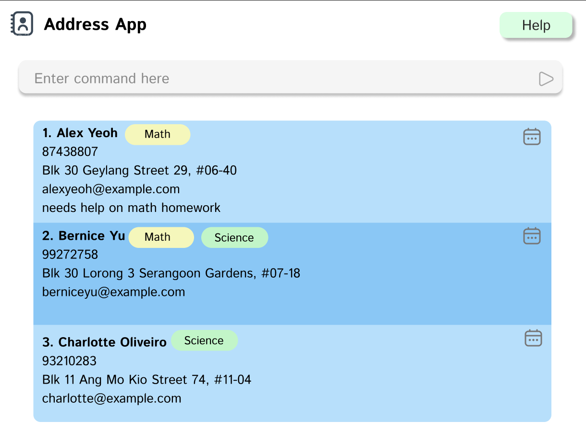

As a private tutor, managing student contacts, schedules and attendance can be overwhelming.
**ClassRosterPro is a desktop app designed specifically for you**, streamlining these tasks to reduce your workload
and free up more time to focus on what truly matters: teaching and preparing quality lessons.

* Table of Contents
{:toc}

--------------------------------------------------------------------------------------------------------------------

## Quick start

1. Ensure you have Java `17` or above installed in your Computer. 
   **Mac users:** Ensure you have the precise JDK version prescribed [here](https://se-education.org/guides/tutorials/javaInstallationMac.html).

1. Download the latest `.jar` file from [here](https://github.com/AY2526S1-CS2103T-W13-4/tp/releases).

1. Copy the file to the folder you want to use as the _home folder_ for your ClassRosterPro.

1. Open a command terminal, `cd` into the folder you put the jar file in, and use the `java -jar classrosterpro.jar` command to run the application. 
   A GUI similar to the below should appear in a few seconds. Note how the app contains some sample data. 
   

1. Type the command in the command box and press Enter to execute it. e.g. typing **`help`** and pressing Enter will open the help window. 
   Some example commands you can try:

   * `list` : Lists all contacts.

   * `add n/John Doe p/98765432 e/johnd@example.com a/John street, block 123, #01-01` : Adds a contact named `John Doe` to the Address Book.

   * `delete 3` : Deletes the 3rd contact shown in the current list.

   * `clear` : Deletes all contacts.

   * `exit` : Exits the app.

1. Refer to the [Features](#features) below for details of each command.

--------------------------------------------------------------------------------------------------------------------

## Features

**:information_source: Notes about the command format:** 

* Words in `UPPER_CASE` are the parameters to be supplied by the user. 
  e.g. in `add n/NAME`, `NAME` is a parameter which can be used as `add n/John Doe`.

* Items in square brackets are optional. 
  e.g `n/NAME [t/TAG]` can be used as `n/John Doe t/friend` or as `n/John Doe`.

* Items with `…`​ after them can be used multiple times including zero times. 
  e.g. `[t/TAG]…​` can be used as ` ` (i.e. 0 times), `t/friend`, `t/friend t/family` etc.

* Parameters can be in any order. 
  e.g. if the command specifies `n/NAME p/PHONE_NUMBER`, `p/PHONE_NUMBER n/NAME` is also acceptable.

* Extraneous parameters for commands that do not take in parameters (such as `help`, `list`, `exit` and `clear`) will be ignored. 
  e.g. if the command specifies `help 123`, it will be interpreted as `help`.

* If you are using a PDF version of this document, be careful when copying and pasting commands that span multiple lines as space characters surrounding line-breaks may be omitted when copied over to the application.

### Viewing help : `help`

Displays a pop-up window containing a complete list of all available commands, grouped by category

Format: `help`

<em>Figure: Help message.</em>

### Adding a person: `add`

Adds a person to the address book.

Format: `add n/NAME p/PHONE_NUMBER e/EMAIL a/ADDRESS [t/TAG]…​`

:bulb: **Tip:**
A person can have any number of tags (including 0)

Examples:
* `add n/John Doe p/98765432 e/johnd@example.com a/John street, block 123, #01-01`
* `add n/Betsy Crowe t/friend e/betsycrowe@example.com a/Newgate Prison p/1234567 t/criminal`

<em>Figure: Result of adding a new student.</em>

### Listing all persons : `list`

Shows a list of all persons in the address book.

Format: `list`

<em>Figure: Result of list command.</em>

### Editing a person : `edit`

Edits an existing person in the address book.

Format: `edit INDEX [n/NAME] [p/PHONE] [e/EMAIL] [a/ADDRESS] [t/TAG]…​`

* Edits the person at the specified `INDEX`. The index refers to the index number shown in the displayed person list. The index **must be a positive integer** 1, 2, 3, …​
* At least one of the optional fields must be provided.
* Existing values will be updated to the input values.
* When editing tags, the existing tags of the person will be removed i.e adding of tags is not cumulative.
* You can remove all the person’s tags by typing `t/` without
    specifying any tags after it.

Examples:
*  `edit 1 p/91234567 e/johndoe@example.com` Edits the phone number and email address of the 1st person to be `91234567` and `johndoe@example.com` respectively.
*  `edit 2 n/Betsy Crower t/` Edits the name of the 2nd person to be `Betsy Crower` and clears all existing tags.

<em>Figure: Result of editing a student.</em>

### Locating persons by name: `find`

Finds persons whose names contain any of the given keywords.

Format: `find KEYWORD [MORE_KEYWORDS]`

* The search is case-insensitive. e.g `hans` will match `Hans`
* The order of the keywords does not matter. e.g. `Hans Bo` will match `Bo Hans`
* Only the name is searched.
* Only full words will be matched e.g. `Han` will not match `Hans`
* Persons matching at least one keyword will be returned (i.e. `OR` search).
  e.g. `Hans Bo` will return `Hans Gruber`, `Bo Yang`

Examples:
* `find John` returns `john` and `John Doe`
* `find alex david` returns `Alex Yeoh`, `David Li` 

<em>Figure: Result of find alex david command.</em>

### Deleting a person : `delete`

Deletes the specified person from the address book.

Format: `delete INDEX`

* Deletes the person at the specified `INDEX`.
* The index refers to the index number shown in the displayed person list.
* The index **must be a positive integer** 1, 2, 3, …​

Examples:
* `list` followed by `delete 2` deletes the 2nd person in the address book.
* `find Betsy` followed by `delete 1` deletes the 1st person in the results of the `find` command.

<em>Figure: Result of deleting a student.</em>

### Scheduling a lesson : `schedule`

Adds an upcoming lesson for a student so you can track classes and avoid clashes.

Format:
`schedule INDEX start/START_TIME end/END_TIME date/DATE sub/SUBJECT`

* Schedules a lesson for the student at the specified `INDEX` (positive integer from the current list).
* Times use 24-hour `HH:mm` (e.g., `09:30`, `14:00`) and dates use `YYYY-MM-DD` (e.g., `2025-09-20`).
* `END_TIME` must be strictly after `START_TIME`.
* Parameters can be in any order.
* Overlapping lessons for the same student on the same date are rejected.
* Exact duplicates (same student, date, start, end, subject) are not added.

Examples:
* `schedule 2 start/13:00 end/14:00 date/2025-09-20 sub/Maths`
    schedules specified lesson for the 2nd person in the current list

<em>Figure: Result of scheduling lesson for the student at index 2.</em>

### Unscheduling a lesson : `unschedule`

Removes a scheduled lesson from a student's timetable.

Format:
`unschedule INDEX lesson/LESSON_INDEX`

* Removes the lesson at `LESSON_INDEX` from the student at the specified `INDEX`.
* Both `INDEX` and `LESSON_INDEX` must be positive integers from their respective lists.
* `INDEX` refers to the student's position in the currently displayed person list.
* `LESSON_INDEX` refers to the lesson's position in that student's lesson list.
* The student must have at least one scheduled lesson.

Examples:
* `unschedule 1 lesson/1`
  removes the 1st lesson from the 1st person in the current list

<em>Figure: Result of unscheduling the 1st lesson from the student at index 1.</em>

### Marking attendance : `mark`

Marks a student as present for all the lessons that are scheduled on the current day. The student's attendance total record in the UI will be updated automatically.

Format: `mark INDEX`

*   Marks attendance for the person at the specified `INDEX`.
*   The index refers to the index number shown in the displayed person list.
*   The index **must be a positive integer** 1, 2, 3, …​
*   An error will be shown if the student has no lesson scheduled for today.

Examples:
* `mark 1` marks the 1st person in the current list as present for today's lesson.

<em>Figure: Result of marking attendance for the student at index 1.</em>

### Unmarking attendance : `unmark`

Unmarks a student's attendance for all the lessons that are scheduled on the current day. The student's attendance total record in the UI will be updated automatically.

Format: `unmark INDEX`

*   Unmarks attendance for the person at the specified `INDEX`.
*   The index refers to the index number shown in the displayed person list.
*   The index **must be a positive integer** 1, 2, 3, …
*   An error will be shown if the student has no lessons scheduled for today or if all today's lessons are already unmarked.
*   Only lessons that are currently marked as present will be unmarked.

Examples:
* `unmark 1` unmarks the 1st person in the current list as absent for today's lesson.

<em>Figure: Result of unmarking attendance for the student at index 1.</em>

### Tagging a student with attributes : `tag`

Adds or updates descriptive attributes for a specific student, such as their subject, age, house, or CCA.
This helps you categorize and filter students more efficiently.

Format:
`tag INDEX attr/KEY=VALUE[,VALUE2]…​ [attr/KEY2=VALUE2]…​`

* Adds or updates the given attributes for the student at the specified `INDEX`.
* The index refers to the index number shown in the displayed student list.
* The index **must be a positive integer** 1, 2, 3, …​
* If the same attribute key already exists (e.g., `subject`), it will be **overridden** with the new values.
* Attributes can have one or multiple comma-separated values.
* If you use the same key multiple times, only the **last occurrence** is applied.
* At least one `attr/` prefix must be provided.

Examples:
* `tag 2 attr/subject=math,science attr/age=16`
  Adds a multi-valued attribute for `subject` and `age=16` to the 2nd student.

<em>Figure: Result of tagging student at index 2 with attributes.</em>

### Deleting attributes from a student : `deltag`

Removes one or more existing attributes from a specific student.
Use this when a previously tagged attribute(s) is no longer relevant.

Format:
`deltag INDEX attr/KEY [attr/KEY2]…​`

* Deletes the specified attribute(s) from the student at the specified INDEX.
* The index refers to the index number shown in the displayed student list.
* The index **must be a positive integer** 1, 2, 3, …
* At least one `attr/` prefix must be provided.
* Multiple attributes can be deleted at once by adding `attr/<attribute>`.
* Only the specified attributes are deleted — other attributes remain unchanged.

Examples:
* `deltag 1 attr/subject`
Deletes the attribute subject from the 1st student.

* `deltag 2 attr/age attr/subject`
Deletes multiple attributes (age, subject) from the 3rd student.

<em>Figure: Result of deleting attributes from the student at index 2.</em>

### Filtering students by attributes : `filter`

Filters and displays students whose attributes match the specified criteria, helping you quickly find students with specific characteristics.

Format: `filter attr/KEY=VALUE[,VALUE2]…​ [attr/KEY2=VALUE2]…​`

* Filters students based on their tagged attributes.
* The search is case-insensitive for both attribute keys and values.
* All specified attribute filters must match for a student to be included (AND logic).
* Multiple values for the same attribute are separated by commas (OR logic within the same attribute).
* At least one `attr/` prefix must be provided.
* For age attributes, values must be valid integers.

Examples:
* `filter attr/subject=math` - Shows students tagged with "math" as their subject
* `filter attr/subject=math,science attr/age=16` - Shows students who have either "math" or "science" as subject AND are age 16
* `filter attr/age=15,16,17` - Shows students who are 15, 16, or 17 years old

<em>Figure: Result of filtering students by subject and age.</em>

### Quick Search : `search`

Allows users to instantly search for contacts by name, email or phone number.

 :bulb: **Tip**
You can still use the `find` command for more specific or multi-keyword searches.
The Quick Search feature is ideal for quick lookups during lessons or when managing attendance.

Examples:
* Typing `search alex` will display contacts such as `Alex Yeoh`
* Typing `search 9876` will display contacts with phone number such as 9876123
* Typing `search john12` will display contacts with email `john123@yahoo.com`

<em>Figure: Result of searching a student's name.</em>

### Recording student grades : `grade`

Records and updates subject-assessment-score pairs for a student so tutors can keep a detailed grade book per student.

Format: `grade INDEX sub/SUBJECT/ASSESSMENT/SCORE [sub/SUBJECT2/ASSESSMENT2/SCORE2]…​`

* Records grades for the student at the specified `INDEX`.
* The index refers to the index number shown in the displayed student list.
* The index **must be a positive integer** 1, 2, 3, …​
* If a subject-assessment combination already exists for the student, the new score will **overwrite** the existing score.
* If the same subject-assessment appears multiple times in one command, the **last occurrence** wins.
* At least one `sub/` prefix must be provided.
* Subject, assessment, and score values cannot be empty.

Examples:
* `grade 2 sub/MATH/WA1/89 sub/SCIENCE/Quiz1/95` - Records Math WA1 score as 89 and Science Quiz1 score as 95 for the 2nd student
* `grade 5 sub/ENGLISH/Final/88 sub/HISTORY/Midterm/92` - Records English Final score as 88 and History Midterm score as 92 for the 5th student

<em>Figure: Result of recording grades for a student.</em>

### Clearing all entries : `clear`

Clears all entries from the address book.

Format: `clear`

### Exiting the program : `exit`

Exits the program.

Format: `exit`

### Saving the data

AddressBook data are saved in the hard disk automatically after any command that changes the data. There is no need to save manually.

### Editing the data file

AddressBook data are saved automatically as a JSON file `[JAR file location]/data/addressbook.json`. Advanced users are welcome to update data directly by editing that data file.

:exclamation: **Caution:**
If your changes to the data file makes its format invalid, AddressBook will discard all data and start with an empty data file at the next run. Hence, it is recommended to take a backup of the file before editing it. 
Furthermore, certain edits can cause the AddressBook to behave in unexpected ways (e.g., if a value entered is outside of the acceptable range). Therefore, edit the data file only if you are confident that you can update it correctly.

--------------------------------------------------------------------------------------------------------------------

## FAQ

**Q**: How do I transfer my data to another Computer? 
**A**: Install the app in the other computer and overwrite the empty data file it creates with the file that contains the data of your previous AddressBook home folder.

--------------------------------------------------------------------------------------------------------------------

## Known issues

1. **When using multiple screens**, if you move the application to a secondary screen, and later switch to using only the primary screen, the GUI will open off-screen. The remedy is to delete the `preferences.json` file created by the application before running the application again.
2. **If you minimize the Help Window** and then run the `help` command (or use the `Help` menu, or the keyboard shortcut `F1`) again, the original Help Window will remain minimized, and no new Help Window will appear. The remedy is to manually restore the minimized Help Window.

--------------------------------------------------------------------------------------------------------------------

## Glossary

| Term         | Definition                                                                                                                               |
|--------------|------------------------------------------------------------------------------------------------------------------------------------------|
| **CLI**      | Command Line Interface. The text-based area where you type commands.                                                                     |
| **GUI**      | Graphical User Interface. The visual part of the application with windows, buttons, and lists.                                           |
| **Command**  | An instruction you type to tell the app what to do (e.g., `add`, `list`).                                                                  |
| **Index**    | The number (starting from 1) next to a student's name in the displayed list. It's used to identify which student a command should apply to. |
| **Prefix**   | A short code (e.g., `n/`, `p/`, `attr/`) used to specify which parameter you are providing.                                                |
| **Parameter**| The information you provide to a command (e.g., `John Doe` in `add n/John Doe`).                                                           |
| **Keyword**  | A word used for searching, especially with the `find` command.                                                                           |
| **Attribute**| A piece of information you can attach to a student using a key and a value (e.g., `subject=math`). Used for tagging and filtering.         |
| **Remark**   | A short, free-text note you can add to a student's profile to remember important details.                                                  |
| **Lesson**   | A scheduled class for a student, which includes a date, start time, end time, and subject.                                                 |
| **Attendance**| A record showing whether a student was present or not for a scheduled lesson.                                                            |

--------------------------------------------------------------------------------------------------------------------

## Command summary

Action | Format, Examples
--------|------------------
**Add** | `add n/NAME p/PHONE_NUMBER e/EMAIL a/ADDRESS [t/TAG]…​`   e.g., `add n/James Ho p/22224444 e/jamesho@example.com a/123, Clementi Rd, 1234665 t/friend t/colleague`
**Clear** | `clear`
**Delete** | `delete INDEX`  e.g., `delete 3`
**Edit** | `edit INDEX [n/NAME] [p/PHONE_NUMBER] [e/EMAIL] [a/ADDRESS] [t/TAG]…​`  e.g.,`edit 2 n/James Lee e/jameslee@example.com`
**Find** | `find KEYWORD [MORE_KEYWORDS]`  e.g., `find James Jake`
**Filter** | `filter attr/KEY=VALUE[,VALUE2]…​ [attr/KEY2=VALUE2]…​`  e.g., `filter attr/subject=math,science attr/age=16`
**Grade** | `grade INDEX sub/SUBJECT/ASSESSMENT/SCORE [sub/SUBJECT2/ASSESSMENT2/SCORE2]…​`  e.g., `grade 2 sub/MATH/WA1/89 sub/SCIENCE/Quiz1/95`
**Schedule Lesson** | `schedule INDEX start/START_TIME end/END_TIME date/DATE sub/SUBJECT`  e.g., `schedule 1 start/14:00 end/15:00 date/2025-09-20 sub/science`
**Unschedule Lesson** | `unschedule INDEX lesson/LESSON_INDEX`  e.g., `unschedule 1 lesson/1`
**Mark Attendance** | `mark INDEX`  e.g., `mark 1`
**Unmark Attendance** | `unmark INDEX`  e.g., `unmark 1`
**Tag Attributes** | `tag INDEX attr/KEY=VALUE[,VALUE2]…​ [attr/KEY2=VALUE2]…​`  e.g., `tag 2 attr/subject=math,science attr/age=16`
**List** | `list`
**Help** | `help`
